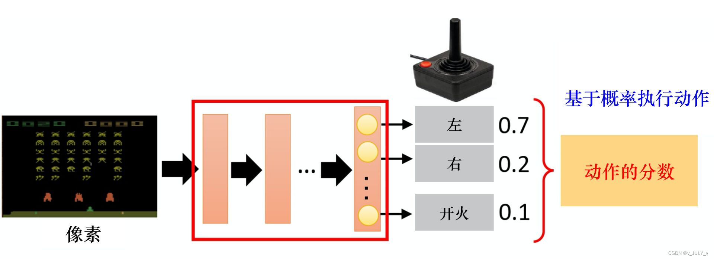
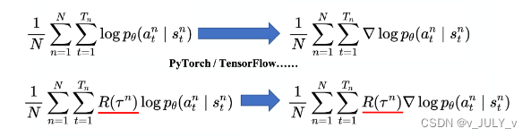
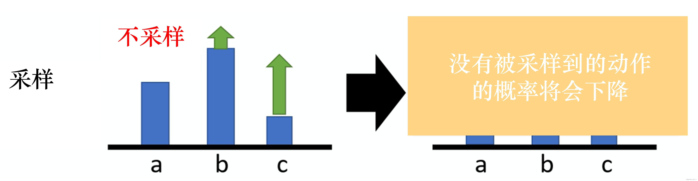
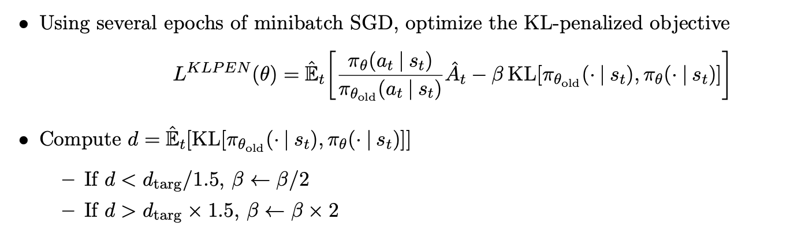
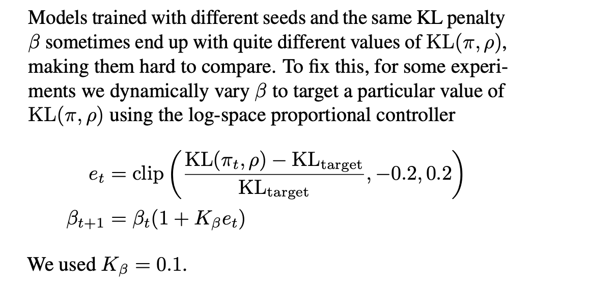
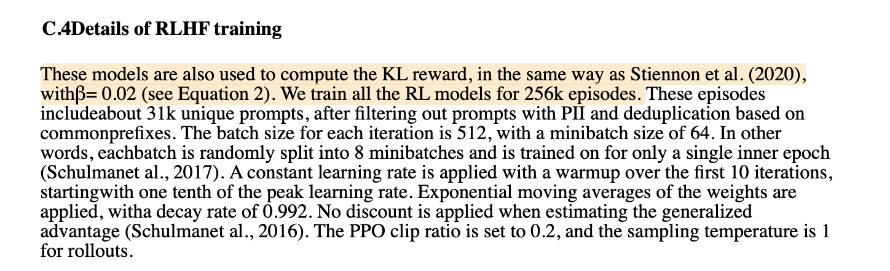
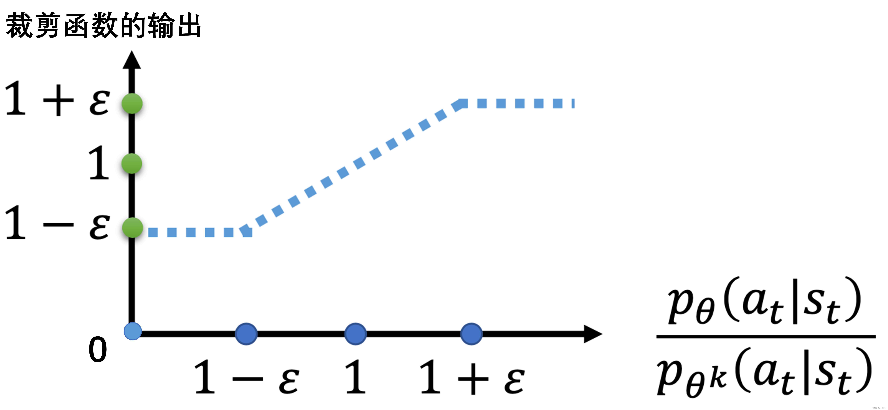

## **前言**
22年底/23年初ChatGPT大火，在写《[ChatGPT技术原理解析](https://blog.csdn.net/v_JULY_v/article/details/128579457 "ChatGPT技术原理解析")》的过程中，发现ChatGPT背后技术涉及到了RL/RLHF，于是又深入研究RL，研究RL的过程中又发现里面的数学公式相比ML/DL更多，于此激发我一边深入RL，一边重修微积分、概率统计、最优化，前者成就了本篇RL极简入门，后者成就了另两篇数学笔记：概率统计极简入门(23修订版)、一文通透优化算法(23修订版).

如上篇ChatGPT笔记所说，本文最早是作为ChatGPT笔记的第一部分的，但RL细节众多，如果想完全在上篇笔记里全部介绍清楚，最后篇幅将长之又长同时还影响完读率，为了避免因为篇幅限制而导致RL很多细节阐述的不够细致，故把RL相关的部分从上文中抽取出来独立成本文.

+   一方面，原有内容(第一部分 RL基础：什么是RL与MRP、MDP，和第四部分 **策略学习**：从策略梯度到TRPO、PPO算法)继续完善、改进，完善记录见本文文末
+   二方面，在原有内容上新增了以下这两部分内容的详细阐述：  
    第二部分 RL进阶之三大表格求解法：DP、MC、TD  
    第三部分 **价值学习**：从n步Sarsa算法到Q-learning、DQN

另，本文有两个特色

1.  定位入门.过去一个多月，我翻遍了十来本RL中文书，以及网上各种RL资料  
    有的真心不错(比如sutton的RL书，但此前从来没有接触过RL的不建议一上来就看该书，除非你看过本文之后)  
    其余大部分要么就是堆砌概念/公式，要么对已经入门的不错，但对还没入门的初学者极度不友好，很多背景知识甚至公式说明、符号说明没有交待，让初学者经常看得云里雾里  
    本文会假定大部分读者此前从来没有接触过RL，会尽可能多举例、多配图、多交待，100个台阶，一步一步拾级而上，不出现任何断层
2.  推导细致.本文之前，99%的文章都不会把PPO算法从头推到尾，<u>本文会把PPO从零推到尾</u>，按照“**RL-策略梯度-重要性采样(重要性权重)-增加基线(避免奖励总为正)-TRPO(加进KL散度约束)-PPO(解决TRPO计算量大的问题)**”的顺序逐步介绍每一步推导  
    且为彻底照顾初学者，本文会解释/说明清楚每一个公式甚至符号，包括推导过程中不省任何一个必要的中间推导步骤，十步推导绝不略成三步

总之，大部分写书、写教材、写文章的人过了那个从不懂到懂的过程，所以懂的人写给不懂的人看，处处都是用已懂的思维去写，而不是用怎么从不懂到懂的思维 去写，未来三年 奋笔疾书，不断给更多初学者普及AI和RL技术

## 第一部分 RL基础：什么是RL与MRP、MDP

## 1.1 入门强化学习所需掌握的基本概念

### 1.1.1 什么是强化学习：依据策略执行动作-感知状态-得到奖励

强化学习里面的概念、公式，相比ML/DL特别多，初学者刚学RL时，很容易被接连不断的概念、公式给绕晕，而且经常忘记概念与公式符号表达的一一对应.

为此，我建议学习RL的第一步就是一定要扎实关于RL的一些最基本的概念、公式(不要在扎实基础的阶段图快或图囵吞枣，不然后面得花更多的时间、更大的代价去弥补)，且把概念与公式的一一对应关系牢记于心，这很重要.当然，为最大限度的提高本文的可读性，我会尽可能的多举例、多配图.

另，RL里面存着大量的数学，考虑到可以为通俗而增加篇幅，但不为了介绍而介绍式的增加篇幅，故

+ 像高数/概率统计里的什么叫[导数](https://zh.wikipedia.org/wiki/%E5%AF%BC%E6%95%B0 "导数")，期望以及什么叫[概率分布](https://blog.csdn.net/v_july_v/article/details/8308762 "概率分布")、熵/香浓熵(Shannon熵)/交叉熵、相对熵(也称KL散度，即[KL divergence](https://zhuanlan.zhihu.com/p/425693597?utm_id=0 "KL divergence"))、多元函数、偏导数，可以参见Wikipedia或《[概率统计极简入门：通俗理解微积分/期望方差/正态分布前世今生(23修订版)](https://blog.csdn.net/v_JULY_v/article/details/8308762 "概率统计极简入门：通俗理解微积分/期望方差/正态分布前世今生(23修订版)")》等类似笔记
+ 而AI一些最基本的概念比如损失函数、[梯度](https://zh.wikipedia.org/wiki/%E6%A2%AF%E5%BA%A6 "梯度")、梯度下降、随机梯度下降(SGD)、[学习率](https://paddlepedia.readthedocs.io/en/latest/tutorials/deep_learning/model_tuning/learning_rate.html "学习率")等，可以参考此篇笔记：《[一文通透优化算法：从梯度下降、SGD到牛顿法、共轭梯度(23修订版)](https://blog.csdn.net/v_JULY_v/article/details/81350035 "一文通透优化算法：从梯度下降、SGD到牛顿法、共轭梯度(23修订版)")》，本文则不过多介绍

话休絮烦，下面进入正题，且先直接给出强化学习的定义和其流程，然后再逐一拆解、说明.

所谓强化学习(Reinforcement Learning，简称RL)，是指基于智能体在复杂、不确定的环境中最大化它能获得的奖励，从而达到自主决策的目的.

经典的强化学习模型可以总结为下图的形式（你可以理解为任何强化学习都包含这几个基本部分：智能体、行为、环境、状态、奖励）：


一般的文章在介绍这些概念时很容易一带而过，这里我把每个概念都逐一解释下  
+ Agent，一般译为智能体，就是我们要训练的模型，类似玩超级玛丽的时候操纵马里奥做出相应的动作，而这个马里奥就是Agent  

+ action(简记为$`a`$)，玩超级玛丽的时候你会控制马里奥做三个动作，即向左走、向右走和向上跳，而马里奥做的这三个动作就是action  

+ Environment，即环境，它是提供reward的某个对象，它可以是AlphaGo中的人类棋手，也可以是自动驾驶中的人类驾驶员，甚至可以是某些游戏AI里的游戏规则  

+ reward(简记为$`r`$)，这个奖赏可以类比为在明确目标的情况下，接近目标意味着做得好则奖，远离目标意味着做的不好则惩，最终达到收益/奖励最大化，且这个奖励是强化学习的核心
+ State(简介为$`S`$)，可以理解成环境的状态，简称状态  

总的而言，Agent依据策略决策从而执行动作action，然后通过感知环境Environment从而获取环境的状态state，进而，最后得到奖励reward(以便下次再到相同状态时能采取更优的动作)，然后再继续按此流程“**依据策略执行动作-感知状态--得到奖励**”循环进行.

### 1.1.2 RL与监督学习的区别和RL方法的分类

此外，RL和监督学习（supervised learning）的区别：

+   监督学习有标签告诉算法什么样的输入对应着什么样的输出（譬如分类、回归等问题）  
    所以对于监督学习，目标是找到一个最优的模型函数，使其在训练数据集上最小化一个给定的损失函数，相当于最小化预测误差    
    最优模型 = arg minE{ [损失函数(标签,模型(特征)] }  
    RL没有标签告诉它在某种情况下应该做出什么样的行为，只有一个做出一系列行为后最终反馈回来的reward，然后判断当前选择的行为是好是坏  
    相当于RL的目标是最大化智能体策略在和动态环境交互过程中的价值，而策略的价值可以等价转换成奖励函数的期望，即<u>最大化累计下来的奖励期望</u>    
    最优策略 = arg maxE { [奖励函数(状态,动作)] }  

+   监督学习如果做了比较坏的选择则会立刻反馈给算法  
    RL的结果反馈有延时，有时候可能需要走了很多步以后才知道之前某步的选择是好还是坏  

+   监督学习中输入是独立分布的，即各项数据之间没有关联  
    RL面对的输入总是在变化，每当算法做出一个行为，它就影响了下一次决策的输入

进一步，RL为得到最优策略从而获取最大化奖励，有

+ **基于值函数的方法**，通过求解一个状态或者状态下某个动作的估值为手段，从而寻找最佳的价值函数，找到价值函数后，再提取最佳策略  
    比如Q-learning、DQN等，适合离散的环境下，比如围棋和某些游戏领域
+ **基于策略的方法**，一般先进行策略评估，即对当前已经搜索到的策略函数进行估值，得到估值后，进行策略改进，不断重复这两步直至策略收敛  
  
    比如策略梯度法(policy gradient，简称PG)，适合连续动作的场景，比如机器人控制领域  
    以及Actor-Criti(一般被翻译为演员-评论家算法)，Actor学习参数化的策略即策略函数，Criti学习值函数用来评估状态-动作对，不过，Actor-Criti本质上是属于基于策略的算法，毕竟算法的目标是优化一个带参数的策略，只是会额外学习价值函数，从而帮助策略函数更好的学习.

    此外，还有对策略梯度算法的改进，比如TRPO算法、PPO算法，当然PPO算法也可称之为是一种Actor-Critic架构，下文会重点阐述.  

可能你还有点懵懵懂懂，没关系，毕竟还有不少背景知识还没有交待，比如RL其实是一个马尔可夫决策过程(Markov decision process，MDP)，而为说清楚MDP，得先从随机过程、马尔可夫过程(Markov process，简称MP)开始讲起，故为考虑逻辑清晰，我们还是把整个继承/脉络梳理下.

## 1.2 什么是马尔科夫决策过程

### 1.2.1 MDP的前置知识：随机过程、马尔可夫过程、马尔可夫奖励

如HMM学习最佳范例中所说，有一类现象是确定性的现象，比如红绿灯系统，红灯之后一定是红黄、接着绿灯、黄灯，最后又红灯，每一个状态之间的变化是确定的  

<div align=center>
 </div>

但还有一类现象则不是确定的，比如今天是晴天，谁也没法百分百确定明天一定是晴天还是雨天、阴天(即便有天气预报)  
<div align=center>
 </div>  

对于这种假设具有$`M`$个状态的模型

1.  共有$`M^2`$个状态转移，因为任何一个状态都有可能是所有状态的下一个转移状态
2.  每一个状态转移都有一个概率值，称为状态转移概率，相当于从一个状态转移到另一个状态的概率
3.  所有的$`M^2`$个概率可以用一个**状态转移矩阵**表示

下面的状态转移矩阵显示的是天气例子中可能的状态转移概率： 
```math  
\begin{matrix}
	&		Today\\
	Yesterday&		\begin{array}{c}
	\\
	sun\\
	cloud\\
	rain\\
\end{array}\left[ \begin{matrix}
	sun&		cloud&		rain&		\\
	0.50&		0.375&		0.125&		\\
	0.25&		0.125&		0.625&		\\
	0.25&		0.375&		0.375&		\\
\end{matrix} \right]\\
\end{matrix}
```  

也就是说，如果昨天是晴天，那么今天是晴天的概率为0.5，是多云的概率为0.375、是雨天的概率为0.125，且这三种天气状态的概率之和必为1.

接下来，我们来抽象建模下.正如概率论的研究对象是静态的随机现象，而随机过程的研究对象是随时间演变的随机现象(比如天气随时间的变化)：

+   随机现象在某时刻t的取值是一个向量随机变量，用$`S_t`$表示,比如上述天气转移矩阵便如下图所示  
```math  
\begin{bmatrix} s_1\rightarrow s_1,s_1\rightarrow s_2,s_1\rightarrow s_3& \\ s_2\rightarrow s_1,s_2\rightarrow s_2,s_2\rightarrow s_3 & \\ s_3\rightarrow s_1,s_3\rightarrow s_2,s_3\rightarrow s_3 & & \end{bmatrix}
```  
+  在某时刻t的状态$`S_t`$通常取决于t时刻之前的状态，我们将已知历史信息$`(S_1,\cdots ,S_t)`$时下一个时刻的状态$`S_{t+1}`$的概率表示成$`P(S_{t+1}|S_1,\cdots ,S_t)`$
如此，便可以定义一个所有状态对之间的转移概率矩阵  
```math  
P=\begin{bmatrix} P(s_1|s_1) \ P(s_2|s_1) \ P(s_3|s_1) \cdots P(s_n|s_1)&\\ P(s_1|s_2) \ P(s_2|s_2) \ P(s_3|s_2) \cdots P(s_n|s_2) &\\ \cdots \cdots \cdots &\\ \cdots \cdots \cdots &\\P(s_1|s_n) \ P(s_2|s_n) \ P(s_3|s_n) \cdots P(s_n|s_n) \end{bmatrix}
```  

+   当且仅当某时刻的状态只取决于上一时刻的状态时，一个随机过程被称为具有**马尔可夫性质**，即$`P(S_{t+1}|S_t) = P(S_{t+1}|S_1,\cdots ,S_t)`$，当然了，虽说当前状态只看上一个状态，但上一个状态其实包含了更上一个状态的信息，所以不能说当下与历史是无关的
+   而具有马尔可夫性质的随机过程便是**马尔可夫过程**

在马尔可夫过程的基础上加入奖励函数$`R`$和折扣因子$`\gamma`$，就可以得到**马尔可夫奖励过程**(Markov reward process，MRP).其中  
+   **奖励函数**，某个状态$`s`$的奖励$`R(s)`$，是指转移到该状态s时可以获得奖励的期望，有$`R(s) = E[R_{t+1}|S_t = s]`$  

    **注意，有的书上奖励函数和下面回报公式中的$`R_{t+1}`$的下标$`t+1`$写为t**，其实严格来说，先有t时刻的状态/动作之后才有t+1时刻的奖励，但应用中两种下标法又都存在，读者注意辨别  
+  此外，实际中，因为一个状态可以得到的奖励是持久的，所有奖励的衰减之和称为回报，可用$`G`$**表示当下即时奖励和所有持久奖励等一切奖励的加权和** (考虑到一般越往后某个状态给的回报率越低，也即奖励因子或折扣因子越小，用$`\gamma`$表示)，从而有  
```math  
    \begin{aligned}G_t &=R_{t+1} + \gamma \cdot R_{t+2}+ \gamma ^2\cdot R_{t+3} + \gamma ^3\cdot R_{t+4}+\cdots\\&= R_{t+1} + \gamma (R_{t+2}+ \gamma \cdot R_{t+3} + \gamma ^2\cdot R_{t+4}+\cdots) \\&= R_{t+1} + \gamma G_{t+1} \end{aligned}
```  

   举个例子，一个少年在面对“上大学、去打工、在家啃老”这三种状态，哪一种更能实现人生的价值呢？相信很多人为长远发展都会选择上大学，因为身边有太多人因为上了大学，而好事连连，比如读研读博留学深造、进入大厂、娶个漂亮老婆、生个聪明孩子,当然了，上大学好处肯定多多，但上大学这个状态对上面4件好事所给予的贡献必然是逐级降低，毕竟越往后，越会有更多或更重要的因素成就更后面的好事，总不能所有好事都百分百归功于最开头选择了“上大学”这个状态/决策嘛

而一个状态的期望回报就称之为这个状态的价值，所有状态的价值则组成了所谓的价值函数，用公式表达为$`V(s) = E[G_t|S_t=s]`$，展开一下可得
```math  
\begin{aligned} V(s) &= E[G_t|S_t=s] \\& = E[R_{t+1} + \gamma G_{t+1}|S_t =s]\\& = E[R_{t+1}|S_t =s] + \gamma E[G_{t+1}|S_t =s]\\& = E[R_{t+1}|S_t = s] + \gamma E[V(S_{t+1})|S_t = s] \end{aligned}
```  

在上式最后一个等式中  
+  前半部分表示当前状态得到的即时奖励$`E[R_{t+1}|S_t = s] = R(s)`$
+  后半部分表示当前状态得到的所有持久奖励$`\gamma E[V(S_{t+1})|S_t = s]`$，可以根据从状态s出发的转移概率得到『至于上述推导的最后一步，在于$`E[G_{t+1}|S_t = s]`$等于$`E[V(S_{t+1})|S_t = s)]`$』  

   有个别朋友在我维护的Machine Learning读书会群里说，对上述推导最后一步的推导过程有疑问，考虑到本文追求详尽细致，加之大部分资料都是把这个当结论默认的，故还是把这个推导过程详细写一下    
```math  
   \begin{aligned} E[G_{t+1}|S_t = s] &= \sum G_{t+1}P\left \{ G_{t+1}|S_t = s \right \} \\& = \sum G_{t+1}\sum_{s'}^{}P\left \{ G_{t+1}|S_{t+1} = s',S_t =s \right \}P\left \{ S_{t+1} = s'|S_t =s \right \} \\& = \sum_{s'}^{}\sum G_{t+1}P\left \{ G_{t+1}|S_{t+1} =s',S_t =s \right \}P\left \{ S_{t+1} =s'|S_t =s \right \} \\& = \sum_{s'}^{}E[G_{t+1}|S_{t+1} = s',S_t =s]P\left \{ S_{t+1}=s'|S_t =s \right \} \\& = \sum_{s'}^{}V(S_{t+1})P\left \{ S_{t+1}=s'|S_t =s \right \} \\& = E[V(S_{t+1})|S_t =s] \end{aligned}
```    
   可能又有同学对上述第二个等式怎么来的又有疑问了，怎么推导呢？我们只需推导出      
```math  
   P\left \{ G_{t+1}|S_t =s \right \} = \sum_{s'}^{}P\left \{ G_{t+1}|S_{t+1} = s',S_t =s \right \}P\left \{ S_{t+1} = s'|S_t =s \right \}
```    
推导过程如下
```math  
   \begin{aligned} P\left \{ G_{t+1}|S_t=s \right \} &= \frac{P\left \{ G_{t+1},S_t=s \right \}}{P(S_t=s)} \\&= \frac{\sum_{s'}^{}P\left \{ G_{t+1},S_{t+1}=s',S_t =s \right \}}{P(S_t =s)} \\&= \frac{\sum_{s'}^{}P\left \{ G_{t+1}|S_{t+1}=s',S_t=s \right \}P(S_{t+1}=s',S_t =s)}{P(S_t =s)}\\&= \frac{\sum_{s'}^{}P\left \{ G_{t+1}|S_{t+1}=s',S_t=s \right \}P(S_{t+1}=s'|S_t =s)P(S_t =s)}{P(S_t =s)}\\&= \sum_{s'}^{}P\left \{ G_{t+1}|S_{t+1}=s',S_t=s \right \}P(S_{t+1}=s'|S_t=s) \end{aligned}
```  

从而，综合前后两个部分可得
```math  
V(s) = R(s) + \gamma \sum_{s'\in S}^{}P(s'|s)V(s')
```  

而这就是所谓的**贝尔曼方程**(bellman equation).该公式精准而简洁，其背后浓缩了很多信息，为形象起见，举个例子，比如状态$`S_1`$得到的即时奖励为$`R_{s1}`$，然后接下来，有  
+  $`P_{12}`$的概率引发$`S_2`$状态，此时状态$`S_2`$得到的即时奖励为$`R_{s2}`$  
   接下来有$`P_{24}`$的概率引发状态$`S_4`$($`S_4`$的即时奖励为$`R_{s4}`$，后续无持久奖励)，有$`P_{25}`$的概率引发$`S_5`$状态($`S_5`$的即时奖励为$`R_{s5}`$，后续无持久奖励)
+  $`P_{13}`$的概率引发$`S_3`$状态，此时$`S_3`$状态得到的即时奖励为$`R_{s3}`$  
   接下来有$`P_{36}`$的概率引发状态$`S_6`$($`S_6`$的即时奖励为$`R_{s6}`$，后续无持久奖励),，有$`P_{37}`$的概率引发状态$`S_7`$($`S_7`$的即时奖励为$`R_{s7}`$，后续无持久奖励)   

其中折扣因此为$`\gamma`$，那么因状态$`S_1`$而得到的一切奖励为
```math  
R_{s1} + \gamma (P_{12}R_{s2} + P_{13}R_{s3}) + \gamma^2(P_{24} R_{s4} + P_{25} R_{s5}) + \gamma^2(P_{36} R_{s6} + P_{37}R_{s7}) \\ = R_{s1} + \gamma (P_{12}R_{s2} + P_{13}R_{s3}) + \gamma^2(P_{24} R_{s4} + P_{25} R_{s5} + P_{36} R_{s6} + P_{37}R_{s7})
```  

类似的，因状态$`S_2`$得到的一切奖励为$`R_{s2} + \gamma (P_{24}R_{s4} + P_{25}R_{s5})`$

> 为更加形象起见，再举一个生活中最常见的“吃饭-抽烟/剔牙”例子  
> 比如你吃完饭后你自己的心情愉悦值即奖励+5，然后下一个状态，有
> + 0.6的概率是抽烟(抽烟带来的心情愉悦值即奖励+7，要不说 饭后一支烟 赛过活神仙呢)
> +   0.4的概率是剔牙(剔牙带来的奖励值+3)  
>
> 假设折扣因子$`\gamma`$(上文说过了，就是一个状态对后续状态的贡献程度)为0.5，且假定
> + 吃饭的状态定义为$`s_1`$，则$`R_{s1} = 5`$
> + 抽烟的状态定义为$`s_2`$，则$`R_{s2} = 7`$，且由于抽烟之后无后续状态，所以$`G_{s2}`$也是$`7`$
> + 剔牙的状态定义为$`s_3`$，则$`R_{s3} = 3`$，且由于剔牙之后无后续状态，所以$`G_{s3}`$也是$`3`$
>
> 从而有：  
> 当从$`s_1 \rightarrow s_2`$时，  
> $`G_{s1} = R_{s1} + \gamma R_{s2} = 5 + 0.5 \times 7 = 8.5`$  
> 当从$`s_1 \rightarrow s_3`$时，   
>.$`G'_{s1} = R_{s1} + \gamma R_{s3} = 5 + 0.5\times 3 = 6.5`$
>
> 由于状态$`s_2`$和状态$`s_3`$没有后续状态，所以$`s_2`$和$`s_3`$对应的状态值函数分别为  
```math
  v_{s2} = R_{s2} = 7  \\v_{s3} = R_{s3} = 3
```  
> 再根据贝尔曼方程$`V(s) = R(s) + \gamma \sum_{s'\in S}^{}P(s'|s)V(s')`$，可得状态$`s_1`$的状态价值函数为
```math
  \begin{aligned} V(s1) &= R_{s1} + \gamma (P_{12}R_{s2} + P_{13}R_{s3}) \\&= 5+ 0.5 \times (0.6\times 7 + 0.4 \times 3) \\&= 7.7 \end{aligned}  
```    
> 当然，你也可以如此计算(可以很明显的看出，计算量不如上述过程简洁，所以一般优先按上述方式计算)  
```math
  \begin{aligned} V(s1) &= E[G_t|S_t=s] \\& = p_{12} \times G^{s2}_{s1} + p_{13} \times G^{s3}_{s1} \\& = P_{12} (R_{s1} + \gamma R_{s2}) + P_{13} (R_{s1} + \gamma R_{s3})\\& = 0.6(5 + 0.5\times 7) + 0.4(5+0.5\times 3) \\& = 7.7 \end{aligned}
```  

上述例子的状态比较少所以计算量不大，但当状态一多，则贝尔曼方程的计算量还是比较大的，而求解较大规模的马尔可夫奖励过程中的价值函数时，可以用的方法包括：动态规划、蒙特卡洛方法、时序差分(temporal difference，简称TD)方法  
当然，其中细节还是不少的，下文第二部分会详述这三大方法

### 1.2.2 马尔可夫决策过程(MDP)：马尔可夫奖励(MRP) + 智能体动作因素

根据上文我们已经得知，在随机过程的基础上  
+   增加马尔可夫性质，即可得马尔可夫过程
+   而再增加奖励，则得到了马尔可夫奖励过程(MRP)
+   如果我们再次增加一个来自外界的刺激比如智能体的动作，就得到了**马尔可夫决策过程**(MDP)  
    通俗讲，MRP与MDP的区别就类似随波逐流与水手划船的区别
> 在马尔可夫决策过程中，$`S_t`$($`S`$是状态的集合)和$`R_t`$($`R`$是奖励的集合)的每个可能的值出现的概率只取决于前一个状态$`S_{t-1}`$和前一个动作$`A_{t-1}`$($`A`$是动作的集合)，并且与更早之前的状态和动作完全无关

换言之，当给定当前状态$`S_t`$(比如$`S_t =s`$，以及当前采取的动作$`A_t`$(比如$`A_t = a`$，那么下一个状态$`S_{t+1}`$出现的概率，可由状态转移概率矩阵表示如下  
```math
  \begin{aligned}P_{ss'}^{a} &= P(S_{t+1}=s'|S_t =s,A_t = a) \\&= {}P(s'|s,a) \end{aligned}
```  

假定在当前状态和当前动作确定后，其对应的奖励则设为$`R_{t+1} = r`$，故sutton的RL一书中，给的状态转移概率矩阵类似为  
```math
  \begin{aligned}p(s',r|s,a)=P\left \{ S_{t+1} = s',R_{t+1} = r |S_t = s,A_t = a \right \} \end{aligned}
```  

从而可得奖励函数即为
```math
  \begin{aligned}R(s,a) &= E[R_{t+1} | S_t = s,A_t = a] \\&=\sum_{s'\in S}^{}p(s',r|s,a) \sum_{r\in R}^{}r \end{aligned}
```  

> 考虑到后来有读者对上面这个公式有疑惑，所以解释下推导步骤
> 
> 1.  首先，计算在状态$`s`$下采取动作$`a`$后，转移到下一个状态$`s'`$并获得奖励$`r`$的概率，表示为$`p(s',r|s,a)`$  
> 
> 2.  然后，我们对所有可能的下一个状态$`s'`$求和，并对所有可能的奖励$`r`$求和(不少情况下，即使状态转移和动作是已知的，奖励$`r`$仍然可能是随机的，比如买股票，股票价格随机波动，导致购买之后的盈亏也具有随机性)
> 3.  最后，我们将这些概率与对应的奖励$`r`$相乘并相加，以得到条件期望
> 
> 当然，如果奖励是确定性的，则可以简化公式，去掉对$`r`$的求和，即：
```math
  R(s,a) = \sum p(s',r|s,a) * r
```  
> 
> 相当于此时只需要计算在状态$`s`$下采取动作$`a`$后，转移到下一个状态$`s'`$的概率乘以确定的奖励$`r`$，然后对所有可能的下一个状态$`s'`$求和以得到条件期望  

至于过程中采取什么样的动作就涉及到策略policy，**策略函数**可以表述为$`\pi`$函数(当然，这里的$`\pi`$跟圆周率没半毛钱关系)
+  从而可得$`a=\pi(s)`$，意味着输入状态$`S`$，策略函数$`\pi`$输出动作$`a`$
+  此外，还会有这样的表述：$`a = \pi _{\theta }(s)`$，相当于在输入状态$`s`$确定的情况下，输出的动作$`a`$只和参数$`\theta`$有关，这个$`\theta`$就是策略函数$`\pi`$的参数
+  再比如这种$`\pi (a|s) = P(A_t = a| S_t = s)`$，相当于输入一个状态$`s`$下，智能体采取某个动作$`a`$的概率

通过上文，我们已经知道不同状态出现的概率不一样（比如今天是晴天，那明天是晴天，还是雨天、阴天不一定），同一状态下执行不同动作的概率也不一样（比如即便在天气预报预测明天大概率是天晴的情况下，你大概率不会带伞，但依然不排除你可能会防止突然下雨而带伞）

而有了动作这个因素之后，我们重新梳理下价值函数
+  首先，通过**状态价值函数**对当前状态进行评估
```math
  \begin{aligned} V_{\pi}(s) &= E_\pi [G_t|S_t = s] \\&= E_\pi [R_{t+1} + \gamma G_{t+1} | S_t = s] \\&= E_\pi [R_{t+1} + \gamma V_\pi (S_{t+1}) | S_t = s] \end{aligned}
```  
   相当于从状态$`s`$出发遵循策略$`\pi`$能获得的期望回报
+  其次，通过“动作价值函数”对动作的评估
```math
  \begin{aligned} Q_\pi (s,a) &= E_\pi [G_t | S_t=s,A_t = a] \\& = E_\pi [R_{t+1} + \gamma G_{t+1}| S_t=s,A_t = a] \\& = E_\pi [R_{t+1} + \gamma Q_\pi (S_{t+1},A_{t+1})| S_t=s,A_t = a] \end{aligned}
```  
   相当于对当前状态$`s`$依据策略$`\pi`$执行动作$`a`$得到的期望回报，这就是大名鼎鼎的$`Q`$函数，得到$`Q`$函数后，进入某个状态要采取的最优动作便可以通过$`Q`$函数得到  
   
   
当有了策略、价值函数和模型3个组成部分后，就形成了一个马尔可夫决策过程（Markov decision process）.如下图所示，这个决策过程可视化了状态之间的转移以及采取的动作.


且通过状态转移概率分布，我们可以揭示状态价值函数和动作价值函数之间的联系了

+ 在使用策略$`\pi`$时，**状态$`S`$的价值等于在该状态下基于策略$`\pi`$采取所有动作的概率与相应的价值相乘再求和的结果**
```math
  V_{\pi}(s) = \sum_{a \in A}^{}\pi (a|s)Q_\pi (s,a)
```  
    
  我猜可能有读者会问怎么来的，简略推导如下  
```math
      \begin{aligned} V_{\pi}(s) &= E_\pi [G_t|S_t = s] \\& = \sum_{a \in A}^{}\pi (a|s)E_\pi [G_t|S_t = s,A_t = a]\\& = \sum_{a \in A}^{}\pi (a|s)Q_\pi (s,a) \end{aligned}
```    
    
+ 而使用策略$`\pi`$时，在状态$`S`$下采取动作$`a`$!的价值等于当前奖励$`R(s,a)`$，加上经过衰减的所有可能的下一个状态的状态转移概率与相应的价值的乘积    
```math
Q_\pi (s,a) = R(s,a) + \gamma \sum_{s' \in S}^{}P(s'|s,a)V_\pi (s')
```    
  针对这个公式 大部分资料都会一带而过，但不排除会有不少读者问怎么来的，考虑到**对于数学公式咱们不能想当然靠直觉的自认为**，所以还是得一五一十的推导下    
```math
    \begin{aligned} Q_\pi (s,a) &= E[G_t|S_t = s,A_t = a] \\&= E[R_{t+1} + \gamma G_{t+1} | S_t =s,A_t = a] \\&= E[R_{t+1}|S_t = s,A_t = a] + \gamma E[ G_{t+1} | S_t =s,A_t = a] \\&= R(s,a) + \gamma \sum_{s'}^{} V_\pi (S_{t+1}) P[S_{t+1} = s' |S_t =s,A_t = a ] \\&= R(s,a) + \gamma \sum_{s'}^{} P_{ss'}^{a}V_\pi (s') \end{aligned}
```    
    
  上述推导过程总共五个等式，其中，第三个等式到第四个等式依据的是  
```math
    E[ G_{t+1} | S_t =s,A_t = a] = \sum_{s'}^{} V_\pi (S_{t+1}) P[S_{t+1} = s' |S_t =s,A_t = a ]
```  
  至于第四个等式到第五个等式依据的是状态转移概率矩阵的定义  
```math
    P_{ss'}^{a} = P(S_{t+1}=s'|S_t =s,A_t = a)
```  

接下来，把上面$`V_\pi (s)`$和$`Q_\pi (s,a)`$的计算结果互相代入，可得**马尔可夫决策的贝尔曼方程**
```math
  V_{\pi}(s) = \sum_{a \in A}^{}\pi (a|s)\left [ R(s,a) + \gamma \sum_{s' \in S}^{}P(s'|s,a)V_\pi (s'))\right ]
```  
```math
  Q_\pi (s,a) = R(s,a) + \gamma \sum_{s' \in S}^{}P(s'|s,a)\left [ \sum_{a' \in A}^{}\pi (a'|s')Q_\pi (s',a') \right ]
```  

上述过程可用下图形象化表示(配图来自文献21)


## 第二部分 RL进阶之三大表格求解法：DP、MC、TD

## 2.1 动态规划法

### 2.1.1 什么是动态规划

上文简单介绍过动态规划，其核心思想在于复杂问题的最优解划分为多个小问题的最优解的求解问题，就像递归一样，且子问题的最优解会被储存起来重复利用

举个例子，输入两个整数n和sum，从数列1，2，3.......n 中随意取几个数，使其和等于sum，要求将其中所有的可能组合列出来.

注意到取n，和不取n个区别即可，考虑是否取第n个数的策略，可以转化为一个只和前n-1个数相关的问题.

+   如果取第n个数，那么问题就转化为“取前n-1个数使得它们的和为sum-n”，对应的代码语句就是sumOfkNumber(sum - n, n - 1)；
+   如果不取第n个数，那么问题就转化为“取前n-1个数使得他们的和为sum”，对应的代码语句为sumOfkNumber(sum, n - 1)

所以其关键代码就是

```cpp
	list1.push_front(n);      //典型的01背包问题
	SumOfkNumber(sum - n, n - 1);   //“放”n，前n-1个数“填满”sum-n
	list1.pop_front();
	SumOfkNumber(sum, n - 1);     //不“放”n，前n-1个数“填满”sum
```

> 其实，这是一个典型的0-1背包问题，其具体描述为：有$`N`$)件物品和一个容量为$`V`$的背包.放入第$`i`$件物品耗费的费用是$`C_i`$(也即占用背包的空间容量)，得到的价值是$`W_i`$，求解将哪些物品装入背包可使价值总和最大.
>
> 简单分析下：这是最基础的背包问题，特点是每种物品仅有一件，可以选择放或不放.用子问题定义状态：即$`F[i,v]`$表示前$`i`$件物品恰放入一个容量为$`v`$的背包可以获得的最大价值
> 
> 对于“将前$`i`$件物品放入容量为$`v`$的背包中”这个子问题，若只考虑第$`i`$件物品的策略（放或不放），那么就可以转化为一个只和前$`i-1`$件物品相关的问题.即： 
>+  如果不放第$`i`$件物品，那么问题就转化为“前$`i-1`$件物品放入容量为$`v`$的背包中”，价值为$`F[i-1,v]`$;
>+  如果放第$`i`$件物品，那么问题就转化为“前$`i-1`$件物品放入剩下的容量为$`v-C_i`$的背包中”，此时能获得的最大价值就是$`F[i-1,v-C_i]`$再加上通过放入第i件物品获得的价值$`W_i`$
> 
>  则其状态转移方程便是：
```math
  F[i,v]=max\{F[i-1,v],F[i-1,v-C_i]W_i\}
```  

通过上述这两个个例子，相信你已经看出一些端倪，具体而言，动态规划一般也只能应用于有最优子结构的问题.最优子结构的意思是局部最优解能决定全局最优解(对有些问题这个要求并不能完全满足，故有时需要引入一定的近似).简单地说，问题能够分解成子问题来解决.

动态规划算法一般分为以下4个步骤：

1.  描述最优解的结构
2.  递归定义最优解的值
3.  按自底向上的方式计算最优解的值   //此3步构成动态规划解的基础.
4.  由计算出的结果构造一个最优解      //此步如果只要求计算最优解的值时，可省略

换言之，动态规划方法的最优化问题的俩个要素：最优子结构性质，和子问题重叠性质

+   最优子结构  
    如果问题的最优解所包含的子问题的解也是最优的，我们就称该问题具有最优子结构性质（即满足最优化原理）.意思就是，总问题包含很多个子问题，而这些子问题的解也是最优的.
+   重叠子问题  
    子问题重叠性质是指在用递归算法自顶向下对问题进行求解时，每次产生的子问题并不总是新问题，有些子问题会被重复计算多次.动态规划算法正是利用了这种子问题的重叠性质，对每一个子问题只计算一次，然后将其计算结果保存在一个表格中，当再次需要计算已经计算过的子问题时，只是在表格中简单地查看一下结果，从而获得较高的效率

更多请参看此文(上面阐述什么是DP的内容就来自此文)：[通俗理解动态规划：由浅入深DP并解决LCS问题(23年修订版)](https://blog.csdn.net/v_JULY_v/article/details/6110269 "通俗理解动态规划：由浅入深DP并解决LCS问题(23年修订版)")

### 2.1.2 通过动态规划法求解最优策略

如果你之前没接触过RL，你确实可能会认为DL只存在于数据结构与算法里，实际上

+   最早在1961年，有人首次提出了DP与RL之间的关系
+   1977年，又有人提出了启发式动态规划，强调连续状态问题的梯度下降法
+   再到1989年，Watkins明确的将RL与DP联系起来，并将这一类强化学习方法表征为增量动态规划

下面，我们考虑如何求解最优策略$`v_*(s)`$

1.  首先，最优策略可以通过最大化$`q_\pi (s,a)`$找到  
```math
      Q_\pi (s,a) = R(s,a) + \gamma \sum_{s' \in S}^{}P(s'|s,a)V_\pi (s')
```  
2.  当$`a= argmax \left \{ Q_*(s,a) \right \}`$时，$`\pi _*(a|s) = 1`$

综合上述两点，可得  
```math
  v_{*}(s) = max \left \{ R(s,a) + \gamma \sum_{s' \in S}^{}P(s'|s,a)V_\pi (s')) \right \}
```  

另，考虑到

```math
  \begin{aligned}R(s,a) &= E[R_{t+1} | S_t = s,A_t = a] \\&=\sum_{s'\in S}^{}p(s',r|s,a) \sum_{r\in R}^{}r \end{aligned}
```  

故也可以如sutton的RL一书上，这样写满足贝尔曼最优方程的价值函数$`V_*(s)`$

```math
  \begin{aligned} v_*(s) &= max E[R_{t+1} + \gamma v_*(S_{t+1}) | S_t =s,A_t =a] \\&= max \sum_{s',r}^{}p(s',r|s,a) [r + \gamma v_*(s')] \end{aligned}
```  

相当于当知道奖励函数和状态转换函数时，便可以根据下一个状态的价值来更新当前状态的价值，意味着可以把计算下一个可能状态的价值当成一个子问题，而把计算当前状态的价值看做当前问题，这不刚好就可以用DP来求解了

于是，sutton的RL一书上给出了DP求解最优策略的算法流程
> 1.初始化
```math
  对s\in S，任意设定V(s)\in \mathbb{R}以及\pi (s) \in A(s)
```  
> 2.策略评估
```math
  \begin{array}{l}循环：\\\,\,\,\,\Delta \leftarrow 0 \\\,\,\,\,对每一个s\in S循环：\\\,\,\,\,\,\,\,\,\,\,\,   v \leftarrow V(s) \\\,\,\,\,\,\,\,\,\,\,\,   V(s) \leftarrow \sum_{s',r}^{} p(s',r|s,\pi (s)) [r + \gamma V(s')] \\\,\,\,\,\,\,\,\,\,\,\,\Delta \leftarrow max(\Delta ,|v - V(s)|) \\直到\Delta <\theta (一个决定估计精度的小正数) \end{array}
```  
> 3.策略改进
```math
  \begin{array}{l}policy-stable \leftarrow true \\对每一个s\in S:\\\,\,\,\,\,old-actiton \leftarrow \pi (s) \\\,\,\,\,\,\pi (s) \leftarrow argmax_{(a)} \left \{ \sum_{s',r}^{}p(s',r|s,a) [r + \gamma V(s')] \right \}\\\,\,\,\,\,如果old-action \neq \pi (s)，那么policy-stable \leftarrow false \\如果policy-stable为true，那么停止并返回V \approx v_*以及\pi \approx \pi _*；否则跳转到2 \end{array}
```  

## 2.2 蒙特卡洛法

蒙特卡洛(monte carlo，简称MC)方法，也称为统计模拟方法，就是通过大量的随机样本来估算或近似真实值，比如近似估算圆的面经、近似定积分、近似期望、近似随机梯度

比如先看估算圆的面积，如下图


可以通过这个式子来近似计算：圆的面积/ 正方形的面积 = 圆中点的个数/正方形中点的个数

类似的，我们也可以用蒙特卡洛方法来估计一个策略在一个马尔可夫决策过程中的状态价值.考虑到 一个状态的价值是它的期望回报，那么如果我们用策略在MDP上采样很多条序列，然后计算从这个状态出发的回报再求其期望是否就可以了？好像可行！公式如下：

```math
  V_\pi (s) = E_\pi [G_t|S_t = s] = \frac{1}{N} \sum_{i=1}^{N}G_{t}^{(i)}
```  

再看下如何估算定积分的值『如果忘了定积分长啥样的，可以通过RL所需数学基础的其中一篇笔记《[概率统计极简入门：通俗理解微积分/期望方差/正态分布前世今生(23修订版)](https://blog.csdn.net/v_JULY_v/article/details/8308762 "概率统计极简入门：通俗理解微积分/期望方差/正态分布前世今生(23修订版)")》回顾下，比如积分可以理解为由无数个无穷小的面积组成的面积S』


如上图，我们可以通过随机取4个点，然后类似求矩形面积那样(底x高)，从而用4个面积$`f(x)(b-a)`$的期望来估算定积分$`\int_{a}^{b}f(x)dx`$的值，为让对面积的估算更准确，我们可以取更多的点，比如$`N`$当$`N \rightarrow \propto`$时

```math
  \int_{a}^{b}f(x)dx = \lim_{N\rightarrow \propto } \frac{1}{N}(b-a)\sum_{i-1}^{N}f(x_i)
```  

接下来

1.  假设令$`q(x) = \begin{cases} \frac{1}{a-b} &  x\in [a,b] \\
0 & \end{cases},\\
且f^*(x) = \begin{cases} \frac{f(x)}{q(x)} & \text{ if } q(x) \neq 0 \\ 0 & \text{ if } q(x) = 0 \end{cases}`$

2.   且考虑到对于连续随机变量$`X`$，其概率密度函数为$`p(x)`$，
期望为$`E[X] = \int_{-\propto }^{\propto }xp(x)dx`$,
则有  
```math
  \int_{a}^{b}f(x)dx = \int_{a}^{b}f^*(x)q(x)dx = E_{x\sim f_{X}(x)}[f^*(x)]]
```    
跟蒙特卡洛方法关联的还有一个重要性采样，不过，暂不急，在第四部分时用到再讲.  

## 2.3 时序差分法及与DP、MC的区别

当面对状态价值函数的求解时   

```math
  \begin{aligned} V_{\pi}(s) &= E_\pi [G_t|S_t = s] \\& = E_\pi [R_{t+1} + \gamma G_{t+1} | S_t = s] \\& = E_\pi [R_{t+1} + \gamma V_\pi (S_{t+1}) | S_t = s] \end{aligned}
```  

上述公式总共三个等式
+ 动态规划(DP)会把上述第三个等式的估计值作为目标，不是因为DP要求需要环境模型本身提供期望值，而是因为真实的$`v_\pi (S_{t+1})`$是未知的，所以只能使用当前的估计值$`V_\pi (S_{t+1})`$来替代
```math
    V(S_t) \leftarrow E_\pi [R_{t+1} + \gamma V(S_{t+1})]
```  
  且DP求解状态S_t的状态值函数时，需要利用所有后续状态$`S_{t+1}`$
```math
    V_{\pi}(s) = \sum_{a \in A}^{}\pi (a|s)\left [ r(s,a) + \gamma \sum_{s' \in S}^{}P(s'|s,a)V_\pi (s'))\right ]
```  
+ 蒙特卡洛方法(MC)会上述把第一个等式的估计值作为目标，毕竟第一个等式中的期望值是未知的，所以我们用样本回报来代替实际的期望回报  
  但MC求解状态$`S_t`$的状态值函数时，需要等一个完整序列结束，因为只有到此时，$`G_t`$才是已知的
```math
    V(S_t) \leftarrow V(S_t) + \alpha [G_t - V(S_t)]
```  

+ 而时序差分(TD)呢，它既要采样得到上述第一个等式的期望值，而且还要通过使用上述第三个等式中当前的估计值V来替代真实值$`v_\pi`$
  且TD每过一个time step就利用奖励$`R_{t+1}`$和值函数$`V(S_{t+1})`$ 更新一次（当然，这里所说的one-step TD 方法，也可以两步一更新，三步一更新….）
  考虑到$`G_t = R_{t+1} + \gamma V(S_{t+1})`$，可得  
```math
    V(S_t) \leftarrow V(S_t) + \alpha \left [ R_{t+1} + \gamma V{S_{t+1}} - V(S_t) \right ]
```  
  此更新法也叫TD(0)法，或者一步时序差分法，  
  $`R_{t+1} + \gamma V{S_{t+1}}`$被称为TD目标，  
  $`\delta = R_{t+1} + \gamma V_\pi (S_{t+1}) - V(S_t)`$被称为TD误差  

  **TD与DP一致的是**，时序差分方法也无需等待交互的最终结果，而可以基于下一个时刻的收益和估计值就可以更新当前状态的价值函数,  
  不需像MC等到N步以后即等一个完整序列结束后才能更新$`V(S_t)`$
  就像不同学生做题，有的学生则是TD派：做完一题就问老师该题做的对不对 然后下一题即更新做题策略，有的学生是MC派：做完全部题才问老师所有题做的对不对 然后下一套试卷更新做题策略  

  **TD与DP不一致的是**，TD俗称无模型的RL算法，不需要像DP事先知道环境的奖励函数和状态转移函数(和MC一样，可以直接从与环境互动的经验中学习策略，事实上，很多现实环境中，其MDP的状态转移概率无从得知)

总之，TD结合了DP和MC，**与DP一致的点时与MC不一致，与DP不一致的点时恰又与MC一致**，某种意义上来说，结合了前两大方法各自的优点，从而使得在实际使用中更灵活，具体而言如下图所示


顺带再举一个例子，好比行军打仗时，为了得到更好的行军路线，将军派一人前去探路  
+   MC的做法相当于一条道走到黑 没走个10公里不回头
+   DP相当于所有道比如10条道 每条道都走个1公里 不错过任何一条可能成为最好道的可能，最后10条道都走完1公里后才返回汇报/反馈
+   TD则相当于先选一条道走个1公里即返回汇报/反馈，之后再走下一条道的1公里

为承上启下更为总结，再说一个问题，即七月ChatGPT课群里有学问提问：校长 在A2C算法中，这个优势函数中的计算$`A(s,a) =Q(s,a) - V(s)`$ 其中这个$`Q(s,a)`$和$`V(s)`$是由神经网络模拟出来的吗

> 关于什么是优势函数 下文会具体阐述，咱们就用上文的知识来一步步推导  
> 因  
> $`\begin{aligned} Q_\pi (s,a) &= E[G_t|S_t = s,A_t = a] \\&= E[R_{t+1} + \gamma G_{t+1} | S_t =s,A_t = a] \\&= E[R_{t+1}|S_t = s,A_t = a] + \gamma E[ G_{t+1} | S_t =s,A_t = a] \\&= R(s,a) + \gamma \sum_{s'}^{} V_\pi (S_{t+1}) P[S_{t+1} = s' |S_t =s,A_t = a ] \\&= R(s,a) + \gamma \sum_{s'}^{} P_{ss'}^{a}V_\pi (s') \end{aligned}`$  
> 从而求解Q时，算是实际奖励$`R + V`$，而$`V`$通过critic网络学习(比如通过蒙特卡洛或时序差分),  
> 最终$`A(s, a) = Q(s,a) - V(s)`$  
> 相当于如春天所说，实践中只需要$`V(s)`$用神经网络来实现就行，因为$`Q(s,a)`$已经可以被$`V(s)`$和$`R`$表示了，不需要再另外实现.


## 2.4 RL的分类：基于模型(Value-base/Policy-based)与不基于模型

根据问题求解思路、方法的不同，我们可以将强化学习分为


+ 基于模型的强化学习(Model-based RL)，可以简单的使用动态规划求解，任务可定义为预测和控制，预测的目的是评估当前策略的好坏，即求解状态价值函数$`V_\pi (S)`$，控制的目的则是寻找最优策略$`\pi ^*`$和$`V_*(s)`$  
  在这里“模型”的含义是对环境进行建模，具体而言，是否已知其$`P`$和$`R`$，即$`p(s'|s,a)`$和$`R(s,a)`$的取值  

  $`\rightarrow`$如果有对环境的建模，    
  那么智能体便可以在执行动作前得知状态转移的情况即$`p(s'|s,a)`$和奖励$`R(s,a)`$，也就不需要实际执行动作收集这些数据； 

  $`\rightarrow`$ 否则便需要进行采样，通过与环境的交互得到下一步的状态和奖励，然后仅依靠采样得到的数据更新策略  

+ 无模型的强化学习(Model-free RL)，又分为  
  **基于价值**的强化学习(Value-based RL)，其会学习并贪婪的选择值最大的动作，即$`a =\underset{a}{\arg \max}\ Q(s,a)`$,最经典的便是off-policy模式的Q-learning和on-policy模式的SARSA，一般得到的是确定性策略，下文第三部分重点介绍.  

  **基于策略**的强化学习(Policy-based RL)，其对策略进行进行建模$`\pi (s,a)`$并优化，一般得到的是随机性策略，下文第四部分会重点介绍.  
  

## 第三部分 价值学习：从n步Sarsa算法到Q-learning、DQN

## 3.1 TD(0)控制/Sarsa(0)算法与TD(n)控制/n步Sarsa算法

既然上文可以用时序差分来估计状态价值函数，那是否可以用类似策略迭代的方法来评估动作价值函数呢？毕竟在无模型的RL问题中，动作价值函数比状态价值函数更容易被评估  

如果用类似TD(0)控制的思路寻找最优的动作价值函数并提取出最优策略，便被称作Sarsa(0)算法，所以，Sarsa所做出的改变很简单，它将原本时序差分方法更新$`V`$的过程，变成了更新$`Q`$，即可以如下表达  
```math
  Q(S_t,A_t) \leftarrow Q(S_t,A_t) + \alpha [R_{t+1} + \gamma Q(S_{t+1},A_{t+1}) - Q(S_t,A_t)]
```  

此外，上文说过，“TD每过一个time step就利用奖励$`R_{t+1}`$和值函数$`V(S_{t+1})`$更新一次，当然，这里所说的one-step TD 方法，也可以两步一更新，三步一更新”，这个所谓的多步一更新我们便称之为N步时序差分法    


首先，我们先回复下回报公式的定义，即为(根据前几项可以看出：$`\gamma`$的上标加$`t+1`$即为$`R`$的下标，反过来，当最后一项$`R`$的下标$`T`$确定后，自然便可以得出$`\gamma`$的上标为$`T -t -1`$
```math
  G_t = R_{t+1} + \gamma R_{t+2} + \gamma ^2 R_{t+3}+\cdots + \gamma ^{T-t-1}R_T
```  
从而有
+ 单步回报：$`G_{t:t+1} = R_{t+1} + \gamma V_t(S_{t+1})`$，即为TD(0)控制$`/Sarsa(0)`$算法  
  
+ 两步回报：$`G_{t:t+2} = R_{t+1} + \gamma R_{t+2} + \gamma ^2V_{t+1}(S_{t+2})`$  
  
+ n步回报：$`G_{t:t+n} = R_{t+1} + \gamma R_{t+2} + \cdots + \gamma ^{n-1}R_{t+n} + \gamma ^nV_{t+n-1}(S_{t+n})`$
  此时，类似于TD(0)预测
```math
    V(S_t) \leftarrow V(S_t) + \alpha \left [ R_{t+1} + \gamma V{S_{t+1}} - V(S_t) \right ]
```    

  有以下状态值更新规则  
```math
    V_{t+n}(S_t) = V_{t+n-1}(S_t) + \alpha \left [ G_{t:t+n} - V_{t+n-1}(S_t) \right ], 0\leq t < T
```    
  而对于其他任意状态$`s(s\neq S_t)`$的价值估计保持不变：$`V_{t+n}(S) = V_{t+n-1}(S)`$

类似的，当用n步时序差分的思路去更新$`Q`$函数则就是所谓的n步Sarsa算法，当我们重新根据动作价值的估计定义如下的b步方法的回报为

```math
  G_{t:t+n} = R_{t+1} + \gamma R_{t+2} + \cdots + \gamma ^{n-1}R_{t+n} + \\\gamma ^nQ_{t+n-1}(S_{t+n},A_{t+n}) \\ n\geq 1,0\leq t < T-n
```  

如此，便可以得到如下$`Q`$的更新方式
```math
  Q_{t+n}(S_t) = Q_{t+n-1}(S_t,A_t) + \alpha \left [ G_{t:t+n} - Q_{t+n-1}(S_t,A_t) \right ],\\0\leq t < T
```  

## 3.2 Q-learning

### 3.2.1 重要性采样：让同策略完成到异策略的转变

Q-learning介绍得闲阐明一个问题，即所谓的同策略学习与异策略学习

首先，先来明确两个概念：

+   行动遵循的行动策略与被评估的目标策略是同一个策略(如果要学习的智能体和与环境交互的智能体是相同的)，则称之为同策略，比如上文介绍的Sarsa  
  
+   行动遵循的行动策略和被评估的目标策略是不同的策略(或如果要学习的智能体和与环境交互的智能体不是相同的)，则称之为异策略，比如即将介绍的Q-learning

而异策略就是基于**重要性采样**的原理实现的(但反过来，*不是说只要采用了重要性采用，就一定是异策略*，比如下文将讲的PPO算法)，即通过使用另外一种分布，来逼近所求分布的一种方法

但具体怎么操作呢？为说明怎么变换的问题，再举一个例子.

> 假设有一个函数$`f(x)`$，$`x`$需要从分布$`p`$中采样，应该如何怎么计算$`f(x)`$的期望值呢？
> 
> 如果分布$`p`$不能做积分，那么只能从分布$`p`$尽可能多采样更多的$`x^{i}`$，然后全都代入到$`f(x)`$，按照蒙特卡洛方法的原则取它的平均值就可以得到近似$`f(x)`$的期望值：
```math
  \mathbb{E}_{x \sim p}[f(x)] \approx \frac{1}{N} \sum_{i=1}^N f(x^i)
```  
> 当不能在分布$`p`$中采样数据，而只能从另外一个分布!$`q`$中去采样数据时($`q`$可以是任何分布），就需要做些变换，如下三步
> 
> 1.  首先，期望值$`\mathbb{E}_{x \sim p}[f(x)]`$的另一种写法是$`\int f(x) p(x) \mathrm{d}x`$，对其进行变换，如下式所示
```math
  \begin{aligned}\int f(x) p(x) \mathrm{d}x&=\int f(x) \frac{p(x)}{q(x)} q(x) \mathrm{d}x \\&=\mathbb{E}_{x \sim q}[f(x){\frac{p(x)}{q(x)}}]\end{aligned}
```  
>    
> 2.  整理下可得（左边是分布$`p`$，右边是分布$`q`$）：  
```math
  \mathbb{E}_{x \sim p}[f(x)]=\mathbb{E}_{x \sim q}\left[f(x) \frac{p(x)}{q(x)}\right]
```  
>     
> 3.  如此，便就可以从$`q`$里面采样 $`x`$，再计算$`f(x) \frac{p(x)}{q(x)}`$，再取期望值
> 
> 所以就算我们不能从$`p`$里面采样数据，但只要能从$`q`$里面采样数据，就可以计算从$`p`$采样$`x`$，然后代入$`f`$以后的期望值

### 3.2.2 Sarsa算法与Q-learning更新规则的对比  
  
和Sarsa(0)算法的更新规则  
```math
  Q(S_t,A_t) \leftarrow Q(S_t,A_t) + \alpha [R_{t+1} + \gamma Q(S_{t+1},A_{t+1}) - Q(S_t,A_t)]
```  
有点像，Q-learning的动作价值函数更新规则如下  
```math
  Q\left(S_{t}, A_{t}\right) = Q\left(S_{t}, A_{t}\right)+\alpha\left[R_{t+1}+\gamma \max _{a'} Q\left(S_{t+1}, a'\right)-Q\left(S_{t}, A_{t}\right)\right]
```  

啥意思呢，一步步来看
1. Q学习有两种策略：目标策略和行为策略  
    目标策略是我们需要学习的策略，一般用$`\pi`$表示，直接在Q表格上使用贪心策略，取它下一步能得到的所有状态，即
```math
  \pi\left(s_{t+1}\right) = \underset{a^{\prime}}{\arg \max}\sim Q\left(s_{t+1}, a^{\prime}\right)
```  
  行为策略 $`\mu`$可以是一个随机的策略，与环境交互(采集轨迹或数据)，但我们采取 $`\varepsilon-`$贪心策略，让行为策略不至于是完全随机的，它是基于Q表格逐渐改进的  

2.  我们可以构造 Q学习目标，Q学习的下一个动作都是通过arg max 操作选出来 的 (不管行为策略怎么探索、去哪探索，反正就是取奖励最大化下的策略)，于是我们可得  
```math
      \begin{aligned} R_{t+1}+\gamma Q\left(S_{t+1}, A^{\prime}\right) &=R_{t+1}+\gamma Q\left(S_{t+1},\arg \max ~Q\left(S_{t+1}, a^{\prime}\right)\right) \\ &=R_{t+1}+\gamma \max _{a^{\prime}} Q\left(S_{t+1}, a^{\prime}\right) \end{aligned}
```  

再次总结一下其与Sarsa的区别

+   在Sarsa算法中，新动作用于更新动作价值函数，并且用于下一时刻的执行工作，这意味着行动策略与目标策略属于同一个策略
+   但在Q-learning算法中，使用确定性策略选出的新动作只用于动作价值函数，而不会被真正执行，当动作价值函数更新后，得到新状态，并基于新状态由$`\varepsilon-`$贪心策略选择得到执行行动，这意味着行动策略与目标策略不属于同一个策略

## 3.3 DQN  待更

## 第四部分 策略学习：从策略梯度、Actor-Criti到TRPO、PPO算法

## 4.1 策略梯度与其突出问题：采样效率低下

本节推导的核心内容参考自Easy RL教程等资料(但修正了原教程上部分不太准确的描述，且为让初学者更好懂，补充了大量的解释说明和心得理解，倪老师则帮拆解了部分公式)。

另，都说多一个公式则少一个读者，本文要打破这点，虽然本节推导很多，但每一步推导都有介绍到，不会省略任何一步推导，故不用担心看不懂(对本文任何内容有任何问题，都欢迎随时留言评论)。

### 4.1.1 什么是策略梯度和梯度计算/更新的流程

策略梯度的核心算法思想是：
+   参数为$`\theta`$的策略$`\pi_{\theta }`$接受状态，输出动作概率分布，在动作概率分布中采样动作，执行动作(形成运动轨迹$`\tau`$)，得到奖励$`r`$，跳到下一个状态
+   在这样的步骤下，可以使用策略$`\pi`$收集一批样本，然后使用梯度下降算法学习这些样本，不过当策略$`\pi`$的参数更新后，这些样本不能继续被使用，还要重新使用策略$`\pi`$与环境互动收集数据

比如REINFORCE算法便是常见的策略梯度算法，类似下图所示(下图以及本节大部分配图/公式均来自easy RL教程)



接下来，详细阐述。首先，我们已经知道了策略函数可以如此表示：$`a = \pi _{\theta }(s)`$

其中，$`\pi _{\theta}`$可以理解为一个我们所熟知的神经网络
+   当你对神经网络有所了解的话，你一定知道通过梯度下降求解损失函数的极小值（忘了的，可以复习下：首先通过正向传播产生拟合值，与标签值做“差”计算，产生误差值，然后对误差值求和产生损失函数，最后对损失函数用梯度下降法求极小值，而优化的对象就是神经网络的参数$`\theta`$

+   类比到πθ这个问题上，现在是正向传播产生动作，然后动作在环境中产生奖励值，通过奖励值求和产生评价函数，此时可以针对评价函数做梯度上升（gradient ascent），毕竟能求极小值，便能求极大值，正如误差能最小化，奖励/得分就能最大化

如何评价策略的好坏呢？

假设机器人在策略$`\pi_{\theta }`$的决策下，形成如下的运动轨迹(类似你玩三国争霸时，你控制角色在各种不同的游戏画面/场景/状态下作出一系列动作，而当完成了系统布置的某个任务时则会得到系统给的奖励，如此，运动轨迹用$`\tau`$表示，从而$`\tau`$表示为一个状态$`s`$、动作$`a`$、奖励值$`r`$不断迁移的过程)

$`\tau = (s_{1},a_{1},r_{1},s_{2},a_{2},r_{2},...,s_{t},a_{t},r_{t})`$

> 可能有读者注意到了，既然奖励是延后的，$`s_t$,$a_t`$后的奖励怎么用$`r_t`$而非$`r_{t+1}`$呢，事实上，sutton RL书上用$`S_0,A_0,R_1,S_1,A_1,R_2,S_2,A_2,R_3,\cdots,S_t,A_t,R_{t+1}`$表示整条轨迹，其实这样更规范，但考虑到不影响大局和下文的推导，本笔记则暂且不细究了

给定智能体或演员的策略参数$`\theta`$，可以计算某一条轨迹$`\tau`$发生的概率为『轨迹$`\tau`$来源于在特定的环境状态下采取特定动作的序列，而特定的状态、特定的动作又分别采样自智能体的动作概率分布$`p_{\theta }(a_{t}|s_{t})`$、状态的转换概率分布$`p(s_{t+1}|s_t,a_t)`$

$`\begin{aligned} p_{\theta}(\tau) &=p\left(s_{1}\right) p_{\theta}\left(a_{1} | s_{1}\right) p\left(s_{2} | s_{1}, a_{1}\right) p_{\theta}\left(a_{2} | s_{2}\right) p\left(s_{3} | s_{2}, a_{2}\right) \cdots \\ &=p\left(s_{1}\right) \prod_{t=1}^{T} p_{\theta}\left(a_{t} | s_{t}\right) p\left(s_{t+1} | s_{t}, a_{t}\right) \end{aligned}`$

其中，有的资料也会把$`p_{\theta }(a_{t}|s_{t})`$写成为$`\pi _{\theta }(a_{t}|s_{t})`$，但由于毕竟是概率，所以更多资料还是写为$`p_{\theta }(a_{t}|s_{t})`$

如何评价策略呢？这个策略评价函数为方便理解也可以称之为策略价值函数，就像上文的状态价值函数、动作价值函数，说白了，评估策略(包括状态、动作)的价值，就是看其因此得到的期望奖励

故考虑到期望的定义，由于每一个轨迹$`\tau`$ 都有其对应的发生概率，**对所有$`\tau`$出现的概率与对应的奖励进行加权最后求和**，即可得期望值：

$`\bar{R}_{\theta}=\sum_{\tau} R(\tau) p_{\theta}(\tau)=\mathbb{E}_{\tau \sim p_{\theta}(\tau)}[R(\tau)]`$

上述整个过程如下图所示


通过上文已经知道，想让奖励越大越好，可以使用梯度上升来最大化期望奖励。而要进行梯度上升，先要计算期望奖励$`\bar{R}_{\theta}`$的梯度。

考虑对$`\bar{R}_{\theta}`$做梯度运算『再次提醒，忘了什么是梯度的，可以通过[一文通透优化算法：从梯度下降、SGD到牛顿法、共轭梯度(23修订版)](https://blog.csdn.net/v_JULY_v/article/details/81350035 "一文通透优化算法：从梯度下降、SGD到牛顿法、共轭梯度(23修订版)")复习下』

$`\nabla \bar{R}_{\theta}=\sum_{\tau}{R}(\tau )\nabla \mathrm{p}_{\theta}(\tau )`$

其中，只有$`p_{\theta}(\tau)`$与$`\theta`$有关。再考虑到$`\nabla f(x)=f(x)\nabla \log f(x)`$，可得

$`\frac{\nabla p_{\theta}(\tau)}{p_{\theta}(\tau)}= \nabla\log p_{\theta}(\tau)`$

从而进一步转化，可得$`\begin{aligned} \nabla \bar{R}_{\theta}&=\mathbb{E}_{\tau \sim p_{\theta}(\tau)}\left[R(\tau) \nabla \log p_{\theta}(\tau)\right] \end{aligned}`$，表示期望的梯度等于对数概率梯度的期望乘以原始函数

> Em，怎么来的？别急，具体推导是
>
> $`\begin{aligned} \nabla \bar{R}_{\theta}&=\sum_{\tau} R(\tau) \nabla p_{\theta}(\tau)\\&=\sum_{\tau} R(\tau) p_{\theta}(\tau) \frac{\nabla p_{\theta}(\tau)}{p_{\theta}(\tau)} \\&= \sum_{\tau} R(\tau) p_{\theta}(\tau) \nabla \log p_{\theta}(\tau) \\ &=\mathbb{E}_{\tau \sim p_{\theta}(\tau)}\left[R(\tau) \nabla \log p_{\theta}(\tau)\right] \end{aligned}`$
>
> 上述推导总共4个等式3个步骤，其中，第一步 先分母分子都乘以一个$`p_{\theta}(\tau)`$，第二步 把$`\frac{\nabla p_{\theta}(\tau)}{p_{\theta}(\tau)}= \nabla \log p_{\theta}(\tau)`$代入计算，第三步 根据期望的定义$`E[X] = \sum_{i}^{}p_ix_i`$做个简单转换，此处的$`X`$就是$`R(\tau )`$
>
> 此外，本文一读者在23年2.24日的留言说，还想了解$`\nabla f(x)=f(x)\nabla \log f(x)`$是怎么推导而来的，这个式子可以通过如下推导得到
>
> 首先，对函数$`f(x)`$取对数得：
>
> $`\log f(x)`$
>
> 对上式求导数得：
>
> $`\frac{d}{dx}\log f(x) = \frac{1}{f(x)}\frac{d}{dx}`$
>
> 将等式两边同乘以$`f(x)`$，得到：
>
> $`f(x) \frac{d}{dx} \log f(x) = \frac{d}{dx}`$
>
> 这个等式表明，我们可以用$`\nabla \log f(x)`$来表示$`\nabla f(x)`$，即：
>
> $`\nabla f(x)=f(x)\nabla \log f(x)`$

然不巧的是，期望值$`\mathbb{E}_{\tau \sim p_{\theta}(\tau)}\left[R(\tau) \nabla \log p_{\theta}(\tau)\right]`$无法计算，按照蒙特卡洛方法近似求期望的原则，可以采样$`N`$条轨迹$`\tau`$并计算每一条轨迹的值，再把每一条轨迹的值加起来除以$`N`$取平均，即($`\tau^{n}`$上标$`n`$代表第$`n`$条轨迹，而$`a_{t}^{n}`$、$`s_{t}^{n}`$则分别代表第$`n`$条轨迹里时刻$`t`$的动作、状态)

$`\begin{aligned} \mathbb{E}_{\tau \sim p_{\theta}(\tau)}\left[R(\tau) \nabla \log p_{\theta}(\tau)\right] &\approx \frac{1}{N} \sum_{n=1}^{N} R\left(\tau^{n}\right) \nabla \log p_{\theta}\left(\tau^{n}\right) \\ &=\frac{1}{N} \sum_{n=1}^{N} \sum_{t=1}^{T_{n}} R\left(\tau^{n}\right) \nabla \log p_{\theta}\left(a_{t}^{n} \mid s_{t}^{n}\right) \end{aligned}`$

> 任何必要的中间推导步骤咱不能省，大部分文章基本都是一笔带过，但本文为照顾初学者甚至更初级的初学者，$`\nabla \log p_{\theta}(\tau)`$中间的推导过程还是要尽可能逐一说明下：
>
> 1.  首先，通过上文中关于某一条轨迹$`\tau`$发生概率的定义，可得
>
>     $`p_\theta (\tau ) = p(s_{1}) \prod_{t=1}^{T_{n}}p(s_{t+1}|s_t,a_t)p_{\theta }(a_{t}|s_{t})`$
>
> 2.  然后两边都取对数，可得
>
>     $`logp_\theta (\tau ) = logp(s_1)\prod_{t=1}^{T_{n}} p(s_{t+1}|s_t,a_t)p_{\theta }(a_{t}|s_{t})`$
>
>     由于乘积的对数等于各分量的对数之和，故可得
>
>     $`logp_\theta (\tau ) = logp(s_1) + \sum_{t=1}^{T_n}(logp(s_{t+1}|s_t,a_t) + logp_{\theta }(a_{t}|s_{t}))`$
>
> 3.  接下来，取梯度可得
>
>     $`\begin{aligned} \nabla \log p_{\theta}(\tau) &= \nabla \left(\log p(s_1)+ \sum_{t=1}^{T_n}\log p(s_{t+1}|s_t,a_t) + \sum_{t=1}^{T_n}\log p_{\theta}(a_t|s_t) \right) \\ &= \nabla \log p(s_1)+ \nabla \sum_{t=1}^{T_n}\log p(s_{t+1}|s_t,a_t) + \nabla \sum_{t=1}^{T_n}\log p_{\theta}(a_t|s_t) \\ &=\nabla \sum_{t=1}^{T_n}\log p_{\theta}(a_t|s_t)\\ &=\sum_{t=1}^{T_n} \nabla\log p_{\theta}(a_t|s_t) \end{aligned}`$
>
>     上述过程总共4个等式，在从第2个等式到第3个等式的过程中，之所以消掉了
>
>     $`\nabla \log p(s_1)+\nabla \sum_{t=1}^{T_n}{\log}p(s_{t+1}|s_t,a_t)`$
>
>     是因为其与$`\theta`$无关(环境状态不依赖于策略)，其对$`\theta`$的梯度为0。

完美！这就是所谓的**策略梯度定理**，我们可以直观地理解该公式

$`\nabla \bar{R}_{\theta}=\frac{1}{N} \sum_{n=1}^{N} \sum_{t=1}^{T_{n}} R\left(\tau^{n}\right) \nabla \log p_{\theta}\left(a_{t}^{n} | s_{t}^{n}\right)`$

1.  即在采样到的数据里面，采样到在某一个状态$`s_t`$要执行某一个动作$`a_t`$，$`(s_t,a_t)`$是在整个轨迹$`\tau`$的里面的某一个状态和动作的对
2.  为了最大化奖励，假设在$`s_t`$执行$`a_t`$，最后发现$`\tau`$的奖励是正的，就要增加在$`s_t`$ 执行$`a_t`$的概率。反之，如果在$`s_t`$执行$`a_t`$会导致$`\tau`$的奖励变成负的， 就要减少在$`s_t`$执行$`a_t`$的概率
3.  最后，用梯度上升来更新参数，原来有一个参数$`\theta`$，把$`\theta`$加上梯度$`\nabla \bar{R}_{\theta}`$，当然要有一个学习率$`\eta`$（类似步长、距离的含义），学习率的调整可用 Adam、RMSProp等方法调整，即

$`\theta \leftarrow \theta+\eta \nabla \bar{R}_{\theta}`$

> 有一点值得说明的是...，为了提高可读性，还是举个例子来说明吧。
>
> 比如到80/90后上大学时喜欢玩的另一个游戏CF(即cross fire，10多年前我在东华理工的时候也经常玩这个，另一个是DNF)，虽然玩的是同一个主题比如沙漠战场，但你每场的发挥是不一样的，即便玩到同一个地方(比如A区埋雷的地方)，你也可能会控制角色用不同的策略做出不同的动作，比如
>+   在第一场游戏里面，我们在状态$`s_1`$采取动作 $`s_1`$，在状态$`s_2`$采取动作 $`a_2`$。且你在同样的状态$`s_1`$下， 不是每次都会采取动作$`a_1`$的，所以我们要记录，在状态 $`s^1_1`$ 采取 $`a^1_1`$、在状态 $`s^1_2`$采取$`a^1_1`$等，整场游戏结束以后，得到的奖励是 $`R(\tau^1)`$
>+   在第二场游戏里面，在状态$`s^2_1`$采取$`a^2_1`$，在状态 $`s^2_2`$采取$`a^2_2`$，采样到的就是$`tau^2`$，得到的奖励是$`R(\tau^2)`$
> 这时就可以把采样到的数据用梯度计算公式把梯度算出来
>
> 1.  也就是把每一个$`s`$与$`a`$的对拿进来，计算在某一个状态下采取某一个动作的对数概率$`\log p_{\theta}\left(a_{t}^{n} | s_{t}^{n}\right)`$，对这个概率取梯度$`\nabla \log p_{\theta}\left(a_{t}^{n} | s_{t}^{n}\right)`$
> 2.  然后在梯度前面乘一个权重$`R\left(\tau^{n}\right)`$，权重就是这场游戏的奖励，这也是和一般分类问题的区别所在
>
>     
>
> 3.  计算出梯度后，就可以通过$`\theta \leftarrow \theta+\eta \nabla \bar{R}_{\theta}`$更新模型了

### 4.1.2 避免采样的数据仅能用一次：重要性采样(为采样q解决p从而增加重要性权重)

然而策略梯度有个问题，在于$`\mathbb{E}_{\tau \sim p_{\theta}(\tau)}`$是对策略$`{\pi _{\theta}}`$采样的轨迹$`\tau`$求期望。一旦更新了参数，从$`\theta`$变成$`\theta'`$，在对应状态s下采取动作的概率$`p_\theta(\tau)`$就不对了，之前采样的数据也不能用了。

换言之，策略梯度是一个会花很多时间来采样数据的算法，其大多数时间都在采样数据。智能体与环境交互以后，接下来就要更新参数，我们只能更新参数一次，然后就要重新采样数据， 才能再次更新参数。


这显然是非常花时间的，怎么解决这个问题呢？为避免采样到的数据只能使用一次的问题，还记得上文介绍过的重要性采样否，使得

> 1.  可以用另外一个策略$`\pi_{\theta'}`$与环境交互，用$`\theta'`$采样到的数据去训练$`\theta`$
> 2.  假设我们可以用$`\theta'`$采样到的数据去训练$`\theta`$，我们可以多次使用$`\theta'`$采样到的数据，可以多次执行梯度上升，可以多次更新参数$`\theta`$， 都只需要用$`\theta'`$采样到的同一批数据

故基于重要性采样的原则，我们可以用另外一个策略$`\pi _{\theta^{'}}`$，与环境做互动采样数据来训练$`\theta`$，从而间接计算$`R(\tau) \nabla \log p_{\theta}(\tau)`$，而当我们转用$`\theta'`$去采样数据训练$`\theta`$后

1.  只需在$`R(\tau) \nabla \log p_{\theta}(\tau)`$的基础上补上一个重要性权重：$`\frac{p_{\theta}(\tau)}{p_{\theta^{\prime}}(\tau)}`$，这个**重要性权重**针对某一个轨迹$`\tau`$用$`\theta`$算出来的概率除以这个轨迹$`\tau`$用$`\theta^{'}`$算出来的概率
2.  注意，上面例子中的$`p`$/$`q`$与此处的$`p_{\theta}(\tau)```  p_{\theta^{\prime}}(\tau)`$没有任何联系，前者只是为了说明重要性权重的两个普通的分布而已

最终加上重要性权重之后，可得

$`\nabla \bar{R}_{\theta}=\mathbb{E}_{\tau \sim p_{\theta^{\prime}(\tau)}}\left[\frac{p_{\theta}(\tau)}{p_{\theta^{\prime}}(\tau)} R(\tau) \nabla \log p_{\theta}(\tau)\right]`$

怎么来的？完整推导如下

$`\begin{aligned}\mathbb{E}_{\tau \sim p_{\theta}(\tau)}\left[R(\tau) \nabla \log p_{\theta}(\tau)\right] &= \sum_{\tau} \left[R(\tau) \nabla \log p_{\theta}(\tau)\right]p_{\theta}(\tau) \\ &= \sum_{\tau} \left[\frac{p_{\theta}(\tau)}{p_{\theta}^\prime(\tau)}R(\tau) \nabla \log p_{\theta}(\tau)\right]p_{\theta}^\prime(\tau) \\ &= \mathbb{E}_{\tau \sim p_{\theta^{\prime}(\tau)}}\left[\frac{p_{\theta}(\tau)}{p_{\theta^{\prime}}(\tau)} R(\tau) \nabla \log p_{\theta}(\tau)\right] \\ & = \nabla \bar{R}_{\theta}\end{aligned}`$

## 4.2 优势演员-评论家算法(Advantage Actor-Criti)：为避免奖励总为正增加基线

梯度的计算好像差不多了？但实际在做策略梯度的时候，并不是给整个轨迹$`\tau`$都一样的分数，而是每一个状态-动作的对会分开来计算，但通过蒙特卡洛方法进行随机抽样的时候，可能会出问题，比如在采样一条轨迹时可能会出现

+   问题1：所有动作均为正奖励
+   问题2：出现**比较大的方差**(另，重要性采样时，采样的分布与当前分布之间也可能会出现比较大的方差，具体下一节详述)

对于第一个问题，举个例子，比如在某一一个状态，可以执行的动作有a、b、c，但我们可能只采样到动作b或者只采样到动作c，没有采样到动作a

1.  但不管采样情况如何，现在所有动作的奖励都是正的，所以采取a、b、c的概率都应该要提高
2.  可实际最终b、c的概率按预期提高了，但因为a没有被采样到，所以a的概率反而下降了
3.  然而问题是a不一定是一个不好的动作，它只是没有被采样到



为了解决奖励总是正的的问题，也为避免方差过大，需要在之前梯度计算的公式基础上加一个基准线$`b`$『此$`b`$指的baseline，非上面例子中的$`b`$，这个所谓的基准线$`b`$可以是任意函数，只要不依赖于动作$`a`$即可』

$`\nabla \bar{R}_{\theta} \approx \frac{1}{N} \sum_{n=1}^{N} \sum_{t=1}^{T_{n}}\left(R\left(\tau^{n}\right)-b\right) \nabla \log p_{\theta}\left(a_{t}^{n} \mid s_{t}^{n}\right)`$

上面说$`b`$可以是任意函数，这个“任意”吧，对初学者而言可能跟没说一样，所以$`b`$到底该如何取值呢
+   $`b`$有一种选择是使用轨迹上的奖励均值，即$`b=\frac{1}{T}\sum_{t=1}^{T}R_t(\tau)`$
    从而使得$`R(\tau)−b`$有正有负
    当$`R(\tau)`$大于平均值$`b`$时，则$`R(\tau)−b`$为正，则增加该动作的概率
    当$`R(\tau)`$小于平均值$`b`$时，则$`R(\tau)−b`$为负，则降低该动作的概率
    如此，对于每条轨迹，平均而言，较好的50%的动作将得到奖励，避免所有奖励均为正或均为负，同时，也减少估计方差
+   $`b`$还可以是状态价值函数$`V_{\pi}(st)可曾还记得2.1节介绍过的所谓Actor-Criti算法(一般被翻译为演员-评论家算法)
Actor学习参数化的策略即策略函数，Criti学习值函数用来评估状态-动作对，然后根据评估结果改进或更新策略

当然，Actor-Criti本质上是属于基于策略的算法，毕竟算法的目标是优化一个带参数的策略(实际用到PPO算法时，会计算一个策略损失)，只是会额外学习价值函数(相应的，运用PPO算法时，也会计算一个价值损失)，从而帮助策略函数更好的学习，而学习优势函数的演员-评论家算法被称为优势演员-评论家(Advantage Actor-Criti，简称A2C)算法
而这个$`R(\tau)-b`$一般被定义为优势函数$`A^{\theta}(s_t,a_t)`$，有几点值得注意

1.  在考虑到评估动作的价值，就看其因此得到的期望奖励，故一般有$`A_\pi (s,a) = Q_\pi (s,a) - V_\pi (s)`$，此举意味着在选择一个动作时，根据该动作相对于特定状态下其他可用动作的执行情况来选择，而不是根据该动作的绝对值(由$`Q`$函数估计)
2.  总之，$`A^{\theta }(s_{t},a_{t})`$要估测的是在状态$`s_{t}`$采取动作$`a_{t}`$是好的还是不好的：即如果$`A^{\theta }(s_{t},a_{t})`$是正的，就要增加概率；如果是负的，就要减少概率
3.  最终在更新梯度的时候，如下式所示『我们用演员$`\theta`$去采样出$`s_{t}`$跟$`a_{t}`$，采样出状态跟动作的对$`(s_{t},a_{t})`$，计算这个状态跟动作对的优势$`A^{\theta }(s_{t},a_{t})`$』

    $`\mathbb{E}_{\left(s_{t}, a_{t}\right) \sim \pi_{\theta}}\left[A^{\theta}\left(s_{t}, a_{t}\right) \nabla \log p_{\theta}\left(a_{t}^{n} | s_{t}^{n}\right)\right]`$


进一步，由于$`A^{\theta}(s_t,a_t)`$是演员$`\theta`$与环境交互的时候计算出来的，基于重要性采样的原则，当从$`\theta`$换到$`\theta'`$的时候，就需要在

$`\mathbb{E}_{\left(s_{t}, a_{t}\right) \sim \pi_{\theta}}\left[A^{\theta}\left(s_{t}, a_{t}\right) \nabla \log p_{\theta}\left(a_{t}^{n} | s_{t}^{n}\right)\right]`$

基础上，$`A^{\theta}(s_t,a_t)`$变换成$`A^{\theta'}(s_t,a_t)`$，一变换便得加个重要性权重(即把$`s_{t}`$、$`a_{t}`$用$`\theta`$采样出来的概率除掉$`s_{t}`$、$`a_{t}`$用$`\theta^{'}`$采样出来的概率)，公式如下『Easy RL纸书第1版上把下面公式中的$`A^{\theta'}(s_t,a_t)`$写成了$`A^{\theta}(s_t,a_t)`$』

$`\mathbb{E}_{\left(s_{t}, a_{t}\right) \sim \pi_{\theta^{\prime}}}\left[\frac{p_{\theta}\left(s_{t}, a_{t}\right)}{p_{\theta^{\prime}}\left(s_{t}, a_{t}\right)} A^{\theta'}\left(s_{t}, a_{t}\right) \nabla \log p_{\theta}\left(a_{t}^{n} | s_{t}^{n}\right)\right]`$

接下来，我们可以拆解$`p_{\theta}(s_{t}, a_{t})`$和$`p_{\theta'}\left(s_{t}, a_{t}\right)`$，即

$`\begin{aligned} p_{\theta}\left(s_{t}, a_{t}\right)&=p_{\theta}\left(a_{t}|s_{t}\right) p_{\theta}(s_t) \\ p_{\theta'}\left(s_{t}, a_{t}\right)&=p_{\theta'}\left(a_{t}|s_{t}\right) p_{\theta'}(s_t) \end{aligned}`$

于是可得公式

$`\mathbb{E}_{\left(s_{t}, a_{t}\right) \sim \pi_{\theta^{\prime}}}\left[\frac{p_{\theta}\left(a_{t} | s_{t}\right)}{p_{\theta^{\prime}}\left(a_{t} | s_{t}\right)} \frac{p_{\theta}\left(s_{t}\right)}{p_{\theta^{\prime}}\left(s_{t}\right)} A^{\theta^{\prime}}\left(s_{t}, a_{t}\right) \nabla \log p_{\theta}\left(a_{t}^{n} | s_{t}^{n}\right)\right]`$

这里需要做一件事情，假设模型是$`\theta`$的时候，我们看到$`s_{t}`$的概率，跟模型是$`\theta^{'}`$的时候，看到$`s_{t}`$的概率是差不多的，即$`p_{\theta}(s_t)=p_{\theta'}(s_t)`$。

> 为什么可以这样假设呢？一种直观的解释就是$`p_{\theta}(s_t)`$很难算，这一项有一个参数$`\theta`$，需要拿$`\theta`$去跟环境做互动，算$`s_{t}`$出现的概率。 尤其是如果输入是图片的话，同样的$`s_{t}`$根本就不会出现第二次。我们根本没有办法估这一项，所以就直接无视这个问题。
>
> 但是$`p_{\theta}(a_t|s_t)`$是很好算，我们有$`\theta`$这个参数，它就是个网络。我们就把$`s_{t}`$带进去，$`s_{t}`$就是游戏画面。 我们有个策略的网络，输入状态$`s_{t}`$，它会输出每一个$`a_{t}`$的概率。所以，我们只要知道$`\theta`$和$`\theta'`$的参数就可以算$`\frac{p_{\theta}\left(a_{t} | s_{t}\right)}{p_{\theta^{\prime}}\left(a_{t} | s_{t}\right)}`$。

所以，实际上在更新参数的时候，我们就是按照下式来更新参数：

$`\mathbb{E}_{\left(s_{t}, a_{t}\right) \sim \pi_{\theta^{\prime}}}\left[\frac{p_{\theta}\left(a_{t} | s_{t}\right)}{p_{\theta^{\prime}}\left(a_{t} | s_{t}\right)} A^{\theta^{\prime}}\left(s_{t}, a_{t}\right) \nabla \log p_{\theta}\left(a_{t}^{n} | s_{t}^{n}\right)\right]`$

从而最终可以从梯度$`\nabla f(x)=f(x) \nabla \log f(x)`$来反推目标函数，当使用重要性采样的时候，要去优化的目标函数如下式所示，把它记$`J^{\theta^{\prime}}(\theta)`$

$`J^{\theta^{\prime}}(\theta)=\mathbb{E}_{\left(s_{t}, a_{t}\right) \sim \pi_{\theta^{\prime}}}\left[\frac{p_{\theta}\left(a_{t} | s_{t}\right)}{p_{\theta^{\prime}}\left(a_{t} | s_{t}\right)} A^{\theta^{\prime}}\left(s_{t}, a_{t}\right)\right]`$

终于大功告成！

## 4.3 基于信任区域的TRPO：加进KL散度解决两个分布相差大或步长难以确定的问题

好巧不巧，看似大功告成了，但重要性采样还是有个问题。具体什么问题呢，为更好的说明这个问题，我们回到上文的那个例子中。

> 还是那两个分布：$`p`$、$`q`$，当不能从$`p`$里面很好的采样数据，而能从$`q`$里面很好的采样数据时，基于重要性采样的原则，虽然我们可以把$`p`$换成任何的$`q`$，但是在实现上，$`p`$和$`q`$的差距不能太大，差距太大，会出问题
$`\mathbb{E}_{x \sim p}[f(x)]=\mathbb{E}_{x \sim q}\left[f(x) \frac{p(x)}{q(x)}\right]`$
>
> 比如，虽然上述公式成立，但如果不是计算期望值，而是
>+  计算方差时$`Var_{x∼p}[f(x)]`$和$`Var_{x∼q}[f(x)\frac{p(x)}{q(x)}]`$是不一样的
> 因为两个随机变量的平均值相同，并不代表它们的方差相同
>
> 此话怎讲？以下是推导过程：
> 将$`f(x)`$、$`f(x) \frac{p(x)}{q(x)}`$分别代入方差的公式
```math
Var[X]=E[X^2]−(E[X])^2   
``` 
> 则分别可得(且考虑到不排除会有比初级更初级的初学者学习本文，故把第二个公式拆解的相对较细)   
```math
Var_{x \sim p}[f(x)]=\mathbb{E}_{x \sim p}\left[f(x)^{2}\right]-\left(\mathbb{E}_{x \sim p}[f(x)]\right)^{2}
```
```math
\begin{aligned} Var_{x \sim q}\left[f(x) \frac{p(x)}{q(x)}\right] &=\mathbb{E}_{x \sim q}\left[\left(f(x) \frac{p(x)}{q(x)}\right)^{2}\right]-\left(\mathbb{E}_{x \sim q}\left[f(x) \frac{p(x)}{q(x)}\right]\right)^{2} \\ &= \int \left(f(x) \frac{p(x)}{q(x)}\right)^{2} q(x) dx - \left(\mathbb{E}_{x \sim p}[f(x)]\right)^{2} \\ &= \int f(x)^{2} \frac{p(x)}{q(x)} p(x)dx - \left(\mathbb{E}_{x \sim p}[f(x)]\right)^{2} \\ &=\mathbb{E}_{x \sim p}\left[f(x)^{2} \frac{p(x)}{q(x)}\right]-\left(\mathbb{E}_{x \sim p}[f(x)]\right)^{2} \end{aligned}
```
>
> 上述两个公式前后对比，可以很明显的看出
>后者的第一项多乘了$`p(x)q(x)`$，如果$`p(x)q(x)`$差距很大，$`f(x)p(x)q(x)`$的方差就会很大  
所以结论就是，如果我们只要对分布$`p`$采样足够多次，对分布$`q`$采样足够多次，得到的期望值会是一样的。但是如果采样的次数不够多，会因为它们的方差差距可能是很大的，所以就可能得到差别非常大的结果。

这意味着什么呢，意味着我们目前得到的这个公式里

$`J^{\theta^{\prime}}(\theta)=\mathbb{E}_{\left(s_{t}, a_{t}\right) \sim \pi_{\theta^{\prime}}}\left[\frac{p_{\theta}\left(a_{t} | s_{t}\right)}{p_{\theta^{\prime}}\left(a_{t} | s_{t}\right)} A^{\theta^{\prime}}\left(s_{t}, a_{t}\right)\right]`$

如果$`p_\theta(a_t|s_t)`$与$`p_{\theta}'(a_t|s_t)`$相差太多，即这两个分布相差太多，重要性采样的结果就会不好。怎么避免它们相差太多呢？这就是TRPO算法所要解决的。

2015年John Schulman等人提出了信任区域策略优化(Trust Region Policy Opimization，简称TRPO)，表面上，TRPO的出现解决了同时解决了两个问题，一个是解决重要性采样中两个分布差距太大的问题，一个是解决策略梯度算法中步长难以确定的问题

+   关于前者，在1.2.2节得到的目标函数基础上(下图第一个公式)，增加了一个KL散度约束(如下图第二个公式)

    $`J^{\theta^{\prime}}(\theta)=\mathbb{E}_{\left(s_{t}, a_{t}\right) \sim \pi_{\theta^{\prime}}}\left[\frac{p_{\theta}\left(a_{t} | s_{t}\right)}{p_{\theta^{\prime}}\left(a_{t} | s_{t}\right)} A^{\theta^{\prime}}\left(s_{t}, a_{t}\right)\right]`$

    $`\begin{aligned} J_{\mathrm{TRPO}}^{\theta^{\prime}}(\theta)=\mathbb{E}_{\left(s_{t}, a_{t}\right) \sim \pi_{\theta^{\prime}}}\left[\frac{p_{\theta}\left(a_{t} | s_{t}\right)}{p_{\theta^{\prime}}\left(a_{t} | s_{t}\right)} A^{\theta^{\prime}}\left(s_{t}, a_{t}\right)\right],\mathrm{KL}\left(\theta, \theta^{\prime}\right)<\delta \end{aligned}`$

    至此采样效率低效的问题通过重要性采样(重要性权重)、以及增加KL散度约束解决了

    > KL散度(KL divergence)，也称相对熵，而相对熵 = 交叉熵 - shannon熵，其衡量的是两个数据分布$`p`$和$`q`$之间的差异
    >
    > $`D_{KL}(P||Q) = E_x log\frac{P(x)}{Q(x)}`$
    >
    > 下图左半边是一组原始输入的概率分布曲线$`p(x)`$，与之并列的是重构值的概率分布曲线$`q(x)`$，下图右半边则显示了两条曲线之间的差异
    >
    > 
    >
    > 顺带从零推导下KL散度的公式
    >
    > 1 所谓**概率**：对于$`x`$，可以定义概率分布为$`p(x)`$或$`q(x)`$
    >
    > 2 所谓**信息**：对$`p(x)`$取对数，加符号得正值$`I(p) = -logp(x)`$，概率越高，包含的信息越小，因为事件越来越确定；相反，概率越低，包含的信息越多，因为事件具有很大的不确定性
    >
    > 3 所谓**Shannon熵**(熵是信息的平均，直观上，Shannon熵是信息在同一分布下的平均)：$`p(x)`$对$`I(p)`$平均，即
    >
    > $`\begin{aligned} H(p) &= E_{x\sim P} [I(p)] \\&= \sum p(x)I(p) \\&= - \sum p(x)logp(x) \end{aligned}`$
    >
    > 4 所谓**交叉熵Cross-Entropy**(直观上，交叉熵是信息在不同分布下的平均)，即指$`p(x)`$对$`I(q)`$平均，即
    >
    > $`\begin{aligned} H(p,q) &= E_{x\sim P} [I(q)] \\&= \sum p(x)I(q) \\&= - \sum p(x)logq(x) \end{aligned}`$
    >
    > 5 所谓相对熵或**KL散度 = 交叉熵 - shannon熵**，即
    >
    > $`\begin{aligned} D_{KL}(p||q) &= H(p,q) - H(p) \\&= -\sum p(x)logq(x) + \sum p(x)logp(x) \\&= -\sum p(x)log\frac{q(x)}{p(x)} \\&= \sum p(x)log\frac{p(x)}{q(x)} \end{aligned}`$
    >
    > 所以如果在KL散度表达式的最前面加个负号，再结合Jensen不等式自然有
    >
    > $`\begin{aligned} -D_{KL}(p||q) &= \sum p(x)log\frac{q(x)}{p(x)} \\& \leq log \sum p(x)\frac{q(x)}{p(x)} \\&= log1 \\&= 0 \end{aligned}`$

+   关于后者，具体而言，当策略网络是深度模型时，沿着策略梯度更新参数，很有可能由于步长太长，策略突然显著变差，进而影响训练效果

    这是1.2.1节，我们已经得到的策略梯度计算、策略梯度更新公式如下(别忘了，学习率$`\eta`$类似步长、距离的含义）分别如下

    $`\nabla \bar{R}_{\theta}=\frac{1}{N} \sum_{n=1}^{N} \sum_{t=1}^{T_{n}} R\left(\tau^{n}\right) \nabla \log p_{\theta}\left(a_{t}^{n} | s_{t}^{n}\right)`$

    $`\theta \leftarrow \theta+\eta \nabla \bar{R}_{\theta}`$

    对这个问题，我们考虑在更新时找到一块信任区域(trust region)，在这个区域上更新策略时能够得到安全性保证，这就是TRPO算法的主要思想


本质上，其实这两个问题是同一个问题(简言之，**避免两个分布相差大即意味着避免步长过大**)。举个例子，比如爬两面都是悬崖的山，左右脚交替往前迈步，无论哪只脚向前迈步都是一次探索

1.  为尽快到达山顶且不掉下悬崖，一方面 你会选择最陡峭的方向，二方面 你会用目光选择一片信任区域，从而尽量远离悬崖边，在信任区域中，首先确定要探索的最大步长（下图的黄色圆圈），然后找到最佳点并从那里继续搜索
2.  好，现在问题的关键变成了，怎么确定每一步的步长呢？如果每一步的步长太小，则需要很长时间才能到达峰值，但如果步长太大，就会掉下悬崖(像不像两个分布之间差距不能太大)
3.  具体做法是，从初始猜测开始可选地，然后动态地调整区域大小。例如，如果新策略和当前策略的差异越来越大，可以缩小信赖区域。怎么实现？KL散度约束!


总之，TRPO就是考虑到连续动作空间无法每一个动作都搜索一遍，因此大部分情况下只能靠猜。如果要猜，就最好在信任域内部去猜。而TRPO将每一次对策略的更新都限制了信任域内，从而极大地增强了训练的稳定性。

至此，PG算法的采样效率低下、步长难以确定的问题都被我们通过TRPO给解决了。但TRPO的问题在哪呢？

TRPO的问题在于把 KL 散度约束当作一个额外的约束，没有放在目标里面，导致TRPO很难计算，总之因为信任域的计算量太大了，John Schulman等人于2017年又推出了TRPO的改进算法：PPO

## 4.4 近端策略优化PPO：解决TRPO的计算量大的问题

### 4.4.1 什么是近端策略优化PPO与PPO-penalty

如上所述，PPO算法是针对TRPO计算量的大的问题提出来的，正因为PPO基于TROP的基础上改进，故PPO也解决了策略梯度不好确定学习率Learningrate(或步长Stepsize)的问题。毕竟通过上文，我们已经得知

1.  如果stepsize过大,学出来的Policy会一直乱动，不会收敛；但如果StepSize太小，想完成训练，我们会等到地老天荒
2.  而PPO利用NewPolicy和OldPolicy的比例，限制了NewPolicy的更新幅度，让策略梯度对稍微大点的Stepsize不那么敏感

具体做法是，PPO算法有两个主要的变种：近端策略优化惩罚（PPO-penalty）和近端策略优化裁剪（PPO-clip），其中PPO-penalty和TRPO一样也用上了KL散度约束。

近端策略优化惩罚PPO-penalty的流程如下

1.  首先，明确目标函数，通过上节的内容，可知咱们需要优化$`J^{\theta'}(\theta)`$，让其最大化

    $`J^{\theta^{\prime}}(\theta)=\mathbb{E}_{\left(s_{t}, a_{t}\right) \sim \pi_{\theta^{\prime}}}\left[\frac{p_{\theta}\left(a_{t} \mid s_{t}\right)}{p_{\theta^{\prime}}\left(a_{t} \mid s_{t}\right)} A^{\theta^{\prime}}\left(s_{t}, a_{t}\right)\right]`$

2.  接下来，先初始化一个策略的参数$`\theta`$，在每一个迭代里面，我们用前一个训练的迭代得到的actor的参数$`\theta '`$与环境交互，采样到大量状态-动作对，根据$`\theta '`$交互的结果，估测$`A^{\theta '}(s_t,a_t)`$

3.  由于目标函数牵涉到重要性采样，而在做重要性采样的时候，$`p_\theta(a_t|s_t)`$不能与$`p_{\theta}'(a_t|s_t)`$相差太多，所以需要在训练的时候加个约束，这个约束就好像正则化的项一样，是$`\theta`$与$`\theta'`$输出动作的 KL散度，用于衡量$`\theta`$与$`theta'`$的相似程度，我们希望在训练的过程中，学习出的$`theta`$与$`theta'`$越相似越好
    所以需要最后使用 PPO 的优化公式：$`\\J_{\mathrm{PPO}}^{\theta^{\prime}}(\theta)=J^{\theta^{\prime}}(\theta)-\beta \mathrm{KL}\left(\theta, \theta^{\prime}\right)`$


    当然，也可以把上述那两个公式合二为一『如此可以更直观的看出，PPO-penalty把KL散度约束作为惩罚项放在了目标函数中(可用梯度上升的方法去最大化它)，此举相对TRPO减少了计算量』

    $`J_{\mathrm{PPO}}^{\theta^{\prime}}(\theta)=\mathbb{E}_{\left(s_{t}, a_{t}\right) \sim \pi_{\theta^{\prime}}}\left[\frac{p_{\theta}\left(a_{t} \mid s_{t}\right)}{p_{\theta^{\prime}}\left(a_{t} \mid s_{t}\right)} A^{\theta^{\prime}}\left(s_{t}, a_{t}\right)\right] \quad-\beta \mathrm{KL}\left(\theta, \theta^{\prime}\right)`$


上述流程有一个细节并没有讲到，即$`\beta`$是怎么取值的呢，事实上，$`\beta`$是可以动态调整的，故称之为自适应KL惩罚(adaptive KL penalty)，具体而言

* 先设一个可以接受的 KL 散度的最大值$`KL_{max}`$
假设优化完$`J_{\mathrm{PPO}}^{\theta^{\prime}}(\theta)=J^{\theta^{\prime}}(\theta)-\beta \mathrm{KL}\left(\theta, \theta^{\prime}\right)`$以后，**KL 散度值太大导致$`KL(\theta,\theta^{\prime})>KL_{max}`$，意味着$`\theta`$与$`\theta'`$差距过大(即学习率/步长过大)**，也就代表后面惩罚的项$`\beta \mathrm{KL}\left(\theta, \theta^{\prime}\right)`$惩罚效果太弱而没有发挥作用，**故增大惩罚把$`\beta`$增大**
* 再设一个 KL 散度的最小值$`KL_{min}`$
  如果优化完$`J_{\mathrm{PPO}}^{\theta^{\prime}}(\theta)=J^{\theta^{\prime}}(\theta)-\beta \mathrm{KL}\left(\theta, \theta^{\prime}\right)`$以后，
  KL散度值比最小值还要小导致$`KL(\theta ,\theta ^{\prime})<KL_{max}`$，意味着$`\theta`$与$`\theta'`$差距过小，也就代表后面惩罚的项$`\beta \mathrm{KL}\left(\theta, \theta^{\prime}\right)`$惩罚效果太强了，我们担心它只优化后一项，使$`\theta`$与$`\theta'`$一样，这不是我们想要的，所以减小惩罚即减小$`\beta`$

> 关于$`\beta`$具体怎么设置的？除了上面提到的自适应KL惩罚(adaptive KL penalty)，来自2017年发表的PPO论文
>
> 
>
> 另外，2019年发表的论文《[Fine-Tuning Language Models from Human Preferences](https://arxiv.org/pdf/1909.08593 "Fine-Tuning Language Models from Human Preferences")》『*也是本博客内另一篇文章“[ChatGPT相关技术论文100篇](https://blog.csdn.net/v_JULY_v/article/details/129508065 "ChatGPT相关技术论文100篇")”中提到的第56篇，另这是论文对应的代码：[微调GPT2](https://github.com/openai/lm-human-preferences "微调GPT2")*』，其中也提到了根据 KL\_target 自适应调节$`\beta`$的算法，这个方法已经被 TRLX/TRL实现
>
> 
>
> 更多训练细节可以看下instructGPT论文原文
>
> 

总之，近端策略优化惩罚可表示为

$`\begin{aligned} &J_{\text{PPO}}^{\theta'}(\theta)=J^{\theta'}(\theta)-\beta \text{KL}\left(\theta, \theta'\right) \\ &J^{\theta'}(\theta) \approx \sum_{\left(s_{t}, a_{t}\right)} \frac{p_{\theta}\left(a_{t} \mid s_{t}\right)}{p_{\theta'}\left(a_{t} \mid s_{t}\right)} A^{\theta'}\left(s_{t}, a_{t}\right)\end{aligned}`$

### 4.4.2 PPO算法的另一个变种：近端策略优化裁剪PPO-clip

如果觉得计算 KL散度很复杂，则还有一个**PPO2**算法，即**近端策略优化裁剪PPO-clip**。近端策略优化裁剪的目标函数里面没有 KL 散度，其要最大化的目标函数为(easy RL上用$`\theta ^k`$代替$`\theta '`$，为上下文统一需要，本笔记的文字部分统一用$`\theta '`$)

$`\begin{aligned} J_{\mathrm{PPO2}}^{\theta'}(\theta) \approx \sum_{\left(s_{t}, a_{t}\right)} \min &\left(\frac{p_{\theta}\left(a_{t} | s_{t}\right)}{p_{\theta'}\left(a_{t} | s_{t}\right)} A^{\theta'}\left(s_{t}, a_{t}\right),{clip}\left(\frac{p_{\theta}\left(a_{t} | s_{t}\right)}{p_{\theta'}\left(a_{t} | s_{t}\right)}, 1-\varepsilon, 1+\varepsilon\right) A^{\theta'}\left(s_{t}, a_{t}\right)\right) \end{aligned}`$

整个目标函数在$`min`$这个大括号里有两部分，最终对比两部分那部分更小，就取哪部分的值，这么做的本质目标就是为了让$`p_{\theta }(a_{t}|s_{t})`$和$`p_{\theta'}(a_{t}|s_{t})`$可以尽可能接近，不致差距太大。

换言之，这个裁剪算法和KL散度约束所要做的事情本质上是一样的，都是为了让两个分布之间的差距不致过大，但裁剪算法相对好实现，别看看起来复杂，其实代码很好写

```python
// ratios即为重要性权重，exp代表求期望，括号里的environment_log_probs代表用于与环境交互的策略
ratios = torch.exp(log_probs - environment_log_probs)

// 分别用sur_1、sur_2来计算公式的两部分
// 第一部分是重要性权重乘以优势函数
sur_1 = ratios * advs

// 第二部分是具体的裁剪过程
sur_2 = torch.clamp(ratios, 1 - clip_eps, 1 + clip_eps) * advs

// 最终看谁更小则取谁
clip_loss = -torch.min(sur_1,sur_2).mean()
```

回到公式，公式的第一部分我们已经见过了，好理解，咱们来重点分析公式的第二部分

$`{clip}\left(\frac{p_{\theta}\left(a_{t} | s_{t}\right)}{p_{\theta'}\left(a_{t} | s_{t}\right)}, 1-\varepsilon, 1+\varepsilon\right) A^{\theta'}\left(s_{t}, a_{t}\right)`$

* 首先是$`{clip}`$括号里的部分，用一句话简要阐述下其核心含义就是：如果$`{p_{\theta}(a_{t}|s_{t})}`$和$`{p_{\theta'}(a_{t}|s_{t})}`$之间的概率比落在范围$`(1- \varepsilon)`$和$`(1+\varepsilon)`$之外，$`\frac{p_{\theta}\left(a_{t} | s_{t}\right)}{p_{\theta'}\left(a_{t} | s_{t}\right)}`$将被剪裁，使得其值最小不小于$`(1- \varepsilon)`$，最大不大于$`(1+\varepsilon)`$



* 然后是$`{clip}`$括号外乘以$`A^{\theta '}(s_t,a_t)`$，如
果$`A^{\theta '}(s_t,a_t)`$大于0，则说明这是好动作，需要增大$`p_{\theta }(a_{t}|s_{t})`$，但$`\frac{p_{\theta}(a_{t}|s_{t})}{p_{\theta'}(a_{t}|s_{t})}`$最大不能超过$`(1+\varepsilon)`$；如
果$`A^{\theta '}(s_t,a_t)`$小于0，则说明该动作不是好动作，  
需要减小$`p_{\theta }(a_{t}|s_{t})`$，但$`\frac{p_{\theta }(a_{t}|s_{t})}{p_{\theta'}(a_{t}|s_{t})}`$最小不能小过$`(1-\varepsilon)`$

>  最后把公式的两个部分综合起来，针对整个目标函数

```math
\begin{aligned} J_{\mathrm{PPO2}}^{\theta'}(\theta) \approx \sum_{\left(s_{t}, a_{t}\right)} \min &\left(\frac{p_{\theta}\left(a_{t} | s_{t}\right)}{p_{\theta'}\left(a_{t} | s_{t}\right)} A^{\theta'}\left(s_{t}, a_{t}\right),{clip}\left(\frac{p_{\theta}\left(a_{t} | s_{t}\right)}{p_{\theta'}\left(a_{t} | s_{t}\right)}, 1-\varepsilon, 1+\varepsilon\right) A^{\theta'}\left(s_{t}, a_{t}\right)\right) \end{aligned}
```

>  如果$`A^{\theta'}(s_t,a_t)`$大于0且$`\frac{p_{\theta}(a_t|s_t)}{p_{\theta'}(a_t|s_t)}`$大于$`(1+\epsilon)`$
>  则相当于第二部分是$`(1+\epsilon)×A^{\theta'}(s_t,a_t)`$，和第一部分$`\frac{p_{\theta}(a_t|s_t)}{p_{\theta'}(a_t|s_t)}*A^{\theta'}(s_t,a_t)`$对比取更小值当然是$`(1+\epsilon)`$的截断值： $`(1+\epsilon )*A^{\theta \prime}(s_t,a_t)`$

>  如果$`A^{\theta'}(s_t,a_t)'大于0且$`\frac{p_{\theta}(a_t|s_t)}{p_{\theta'}(a_t|s_t)}`$小于$`(1-\epsilon)`$
则相当于第二部分是$`(1-\epsilon)*A^{\theta'}(s_t,a_t)`$，和第一部分$`\frac{p_{\theta}(a_t|s_t)}{p_{\theta'}(a_t|s_t)}*A^{\theta'}(s_t,a_t)`$对比取更小值当然是原函数值： $`\frac{p_{\theta}(a_t|s_t)}{p_{\theta \prime}(a_t|s_t)}*A^{\theta \prime}(s_t,a_t)`$
> 
>
> 反之，**如果** $`A^{\theta \prime}(s_t,a_t)`$ **小于0，则最终目标函数的取值为了更小则和** $`A^{\theta \prime}(s_t,a_t)`$**大于0时反过来**，毕竟加了个负号自然一切就不同了，为方便初学者一目了然，咱们还是把计算过程列出来，即
> 
>+   如果$`A^{\theta'}(s_t,a_t)'小于0且$`\frac{p_{\theta}(a_t|s_t)}{p_{\theta'}(a_t|s_t)}`$大于$`(1+\epsilon)`$
则相当于第二部分是$`(1+\epsilon)*A^{\theta'}(s_t,a_t)`$，和第一部分$`\frac{p_{\theta}(a_t|s_t)}{p_{\theta'}(a_t|s_t)}*A^{\theta'}(s_t,a_t)`$对比取更小值当然是原函数值： $`\frac{p_{\theta}(a_t|s_t)}{p_{\theta \prime}(a_t|s_t)}*A^{\theta \prime}(s_t,a_t)`$
>
>+   如果$`A^{\theta'}(s_t,a_t)`$小于0且$`\frac{p_{\theta}(a_t|s_t)}{p_{\theta'}(a_t|s_t)}`$小于$`(1-\epsilon)`$
则相当于第二部分是$`(1-\epsilon)×A^{\theta'}(s_t,a_t)`$，和第一部分$`\frac{p_{\theta}(a_t|s_t)}{p_{\theta'}(a_t|s_t)}*A^{\theta'}(s_t,a_t)`$对比取更小值当然是$`(1-\epsilon)`$的截断值： $`(1-\epsilon )*A^{\theta \prime}(s_t,a_t)`$

### 4.4.3 PPO算法的一个简单实现：对话机器人

综上，PPO算法是一种具体的Actor-Critic算法实现，比如在对话机器人中，输入的prompt是state，输出的response是action，想要得到的策略就是怎么从prompt生成action能够得到最大的reward，也就是拟合人类的偏好。具体实现时，可以按如下两大步骤实现

1.  **首先定义4个模型：Actor(action\_logits)、SFT(sft\_logits)、Critic(value)、RM「r(x, y)」，和kl\_div、reward、优势函数adv**
    从prompt库中采样出来的prompt在经过SFT(微调过GPT3/GPT3.5的模型称之为SFT)做generate得到一个response，这个『prompt + response』定义为sequence(这个采样的过程是批量采样进行generate，得到一个sequence buffer)，然后这个sequence buffer的内容做batched之后输入给4个模型做inference

    

    这4个模型分别为Actor、SFT、Critic、RM，其中：
    Actor和SFT都是175B的模型，且Actor参数由SFT初始化(SFT是baseline)，Actor输出action\_logits，SFT输出sft\_logits
    sft\_logits和action\_logits做kl\_div，为了约束actor模型的更新step不要偏离原始模型SFT太远

    Critic和RM是6B的模型，Critic参数由RM初始化
    Critic输出标量value，RM输出标量r(x, y)，由r(x, y)和kl\_div计算得到reward，

    reward和value计算得到adv
2.  **其次，通过pg\_loss和value\_loss优化迭代**
    Actor的流程是取出sequence，然后inference生成新的logits，再和sequence对应的之前的logits计算ratio，和adv计算出pg\_loss，也就是actor的loss，然后反向传播，优化器迭代
    Critic的流程是取出sequence，然后inference得到新的value，和old\_value做**clip\_value，再和reward计算value loss**，然后反向传播，优化器迭代

    


至于代码实现可以参阅此文：[类ChatGPT逐行代码解读(2/2)：从零实现ChatLLaMA、ColossalChat、DeepSpeed Chat](https://blog.csdn.net/v_JULY_v/article/details/129996493 "类ChatGPT逐行代码解读(2/2)：从零实现ChatLLaMA、ColossalChat、DeepSpeed Chat")

## 后记

1.6日决定只是想写个ChatGPT通俗导论，但为了讲清楚其中的PPO算法，更考虑到之后还会再写一篇强化学习极简入门，故中途花了大半时间去从头彻底搞懂RL，最终把网上关于RL的大部分中英文资料都翻遍之外(详见参考文献与推荐阅读)，还专门买了这几本书以系统学习

+   第1本，《白话强化学习与pytorch》，偏通俗，对初学者友好，缺点是部分内容混乱，且对部分前沿/细节比如PPO算法阐述不足，毕竟19年出版的了
+   第2本，《EazyRL强化学习教程》，基于台大李宏毅等人的公开课，虽有不少小问题且其对MDP和三大表格求解法的阐述比较混乱，但其对策略梯度和PPO的阐述于初学入门而言还不错的
+   第3本，《动手学强化学习》，张伟楠等人著，概念讲解、公式定义都很清晰，且配套代码实现，当然 如果概念讲解能更细致则会对初学者更友好
+   第4本，《深度强化学习》，王树森等人著，偏原理讲解(无代码)，此书对于已对RL有一定了解的是不错的选择
+   第5本，《强化学习2》，权威度最高但通俗性不足，当然 也看人，没入门之前你会觉得此书晦涩，入门之后你会发现经典还是经典、不可替代，另书之外可配套七月的强化学习2带读课
+   第6本，《深度强化学习：基于Python的理论与实践》，理论讲的挺清楚，代码实践也不错
+   第7本，《强化学习(微课版)》，这本书是作为RL教材出版的，所以有教材的特征，即对一些关键定理会举例子展示实际计算过程，比如马尔可夫决策的计算过程，对初学者友好

总之，RL里面的概念和公式很多(相比ML/DL，RL想要机器/程序具备更好的自主决策能力)，而

+  一方面，绝大部分的资料没有站在初学者的角度去通俗易懂化、没有把概念形象具体化、没有把公式拆解举例化(如果逐一做到了这三点，何愁文章/书籍/课程不通俗)
+  二方面，不够通俗的话，则资料一多，每个人的公式表达习惯不一样便会导致各种形态，虽说它们最终本质上都是一样的，可当初学者还没有完全入门之前，就不一定能一眼看出背后的本质了，然后就不知道该以哪个为准，从而丧失继续前进的勇气(这种情况下，要么硬着头皮继续啃 可能会走弯路，要么通过比如七月在线的课程问老师或人 提高效率少走弯路)

   比如一个小小的策略梯度的计算公式会有近10来种表达，下面特意贴出其中6种，供读者辨别  

第一种，本笔记和Easy RL中用的
```math
\nabla \bar{R}_{\theta}=\frac{1}{N}\sum_{n=1}^N{\sum_{t=1}^{T_n}{R}}\left( \tau ^n \right) \nabla \log p_{\theta}\left( a_{t}^{n}|s_{t}^{n} \right) 
```
第二种，Sutton强化学习《Reinforcement Learning: An Introduction》第一版中用的

```math
\nabla _{\theta}J(\pi _{\theta})=\sum_s^{}{d^{\pi}}(s)\sum_a^{}{\nabla _{\theta}}\pi _{\theta}(a|s)Q^{\pi}(s,a)=E_{\pi}[\gamma ^t\nabla _{\theta}log\pi _{\theta}(A_t|S_t)Q^{\pi}(S_t,A_t)]
```

 其中
$`
d\pi (s)=\sum_{t=0}^{\infty}{\gamma ^t}Pr(s_0\rightarrow s,t,\pi )=\sum_{t=0}^{\infty}{\gamma ^t}Pr\left\{ S_t=s|s_0,\pi \right\} 
`$叫做discounted state distribution

第三种，David sliver在2014年的《Deterministic Policy Gradient Algorithm》论文中用的

```math
\nabla _{\theta}J(\pi _{\theta})=\int_S^{}{\rho ^{\pi}}(s)\int_A^{}{\nabla _{\theta}}\pi _{\theta}(a|s)Q^{\pi}(s,a)=E_{s\sim \rho ^{\pi},a\sim \pi _{\theta}}[\nabla _{\theta}log\pi _{\theta}(a|s)Q^{\pi}(s,a)]
```
其中，$`\rho ^{\pi}(s)`$与上述$`d\pi (s)`$相同，都是discounted state distribution。

第四种，肖志清《强化学习：原理与Python实现》中用的

   
```math
\nabla _{\theta}J(\pi _{\theta})=E[\sum_{t=0}^{\infty}{\gamma ^t}\nabla _{\theta}log\pi _{\theta}(A_t|S_t)Q^{\pi}(S_t,A_t)]
```
第五种，Sutton强化学习在2018年的第二版中用的

```math
\nabla _{\theta}J(\pi _{\theta})\propto \sum_S^{}{\mu ^{\pi}}(s)\sum_a^{}{\nabla _{\theta}}\pi _{\theta}(a|s)Q^{\pi}(s,a)=E_{\pi}[\nabla _{\theta}log\pi _{\theta}(A_t|S_t)Q^{\pi}(S_t,A_t)]

```

其中，
```math
\mu ^{\pi}(s)=\lim_{t\rightarrow \propto} Pr(S_t=s|s_0,\pi _{\theta})
```
是stationary distribution (undiscounted state distribution)

第六种，Open AI spinning up教程中用的

```math
\nabla _{\theta}J(\pi _{\theta})=E_{(\tau \sim \pi )}[\sum_{t=0}^T{\nabla _{\theta}}log\pi _{\theta}(a_t|s_t)Q^{\pi}(s_t,a_t)]

```

## 参考文献与推荐阅读

1.  关于强化学习入门的一些基本概念
2.  《白话强化学习与Pytorch》，此书让我1.6日起正式开启RL之旅，没看此书之前，很多RL资料都不好看懂
3.  《EazyRL强化学习教程》，基于台大李宏毅和UCLA周博磊等人的RL公开课所编著，其[GitHub](https://github.com/datawhalechina/easy-rl "GitHub")、[其在线阅读地址](https://datawhalechina.github.io/easy-rl/#/ "其在线阅读地址")
4.  《动手学强化学习》，张伟楠等人著
5.  台大李宏毅RL公开课，这是其：[视频/PPT/PDF下载地址](http://speech.ee.ntu.edu.tw/~tlkagk/courses_MLDS18.html "视频/PPT/PDF下载地址")
6.  UCLA周博磊RL公开课，这是其[：GitHub地址](https://github.com/zhoubolei/introRL "：GitHub地址")
7.  关于Q-leaning的几篇文章：1[如何用简单例子讲解 Q - learning 的具体过程？](https://www.zhihu.com/question/26408259 "如何用简单例子讲解 Q - learning 的具体过程？")2[莫烦：什么是 Q-Learning](https://zhuanlan.zhihu.com/p/24808797 "莫烦：什么是 Q-Learning")
8.  AlphaGo作者之一David Silver主讲的[增强学习笔记1](https://zhuanlan.zhihu.com/p/50478310 "增强学习笔记1")、[笔记2](https://www.zhihu.com/column/reinforce "笔记2")，另附其讲授的《UCL Course on RL》的[课件地址](https://www.davidsilver.uk/teaching/ "课件地址")
9.  huggingface的两篇RL教程：[An Introduction to Deep Reinforcement Learning](https://huggingface.co/blog/deep-rl-intro "An Introduction to Deep Reinforcement Learning")、[GitHub：The Hugging Face Deep Reinforcement Learning Course](https://github.com/huggingface/deep-rl-class "GitHub：The Hugging Face Deep Reinforcement Learning Course")

10.  TRPO原始论文：[Trust Region Policy Optimization](https://arxiv.org/pdf/1502.05477.pdf "Trust Region Policy Optimization")
11.  **PPO原始论文**：[Proximal Policy Optimization Algorithms](https://arxiv.org/pdf/1707.06347.pdf "Proximal Policy Optimization Algorithms")
12.  PPO算法解读(英文2篇)：解读1 [RL — Proximal Policy Optimization (PPO) Explained](https://jonathan-hui.medium.com/rl-proximal-policy-optimization-ppo-explained-77f014ec3f12 "RL — Proximal Policy Optimization (PPO) Explained")、解读2[Proximal Policy Optimization (PPO)](https://huggingface.co/blog/deep-rl-ppo "Proximal Policy Optimization (PPO)")
13.  PPO算法解读(中文4篇)：[Easy RL上关于PPO的详解](https://datawhalechina.github.io/easy-rl/#/chapter5/chapter5 "Easy RL上关于PPO的详解")、[详解近端策略优化](https://www.cnblogs.com/xingzheai/p/15931681.html "详解近端策略优化")、[详解深度强化学习 PPO算法](https://zhuanlan.zhihu.com/p/88525394?utm_id=0 "详解深度强化学习 PPO算法")、[ChatGPT第二弹：PPO算法](https://mp.weixin.qq.com/s?__biz=MjM5ODkzMzMwMQ==&mid=2650435573&idx=2&sn=427f3ad2cb6ab5120686652fd9a64b8f&chksm=becde9af89ba60b9a6a4306b126b32deff8a78788208fd431a40f89736390c6883f35dc0b71d&mpshare=1&scene=23&srcid=0208gSWRajh40YzsiJ2YqN2B&sharer_sharetime=1675828126672&sharer_shareid=8dff0e13d79dbe85e759d04101e63bbf#rd "ChatGPT第二弹：PPO算法")
14.  PPO算法实现：[GitHub - lvwerra/trl: Train transformer language models with reinforcement learning.](https://github.com/lvwerra/trl "GitHub - lvwerra/trl: Train transformer language models with reinforcement learning.")
15.  [如何选择深度强化学习算法？MuZero/SAC/PPO/TD3/DDPG/DQN/等](http://www.deeprlhub.com/d/166-muzerosacppotd3ddpgdqn "如何选择深度强化学习算法？MuZero/SAC/PPO/TD3/DDPG/DQN/等")
16.  [如何通俗理解隐马尔可夫模型HMM？](https://www.julyedu.com/questions/interview-detail?kp_id=30&cate=NLP&quesId=2765 "如何通俗理解隐马尔可夫模型HMM？")
17.  [HMM学习最佳范例](https://www.52nlp.cn/hmm%E5%AD%A6%E4%B9%A0%E6%9C%80%E4%BD%B3%E8%8C%83%E4%BE%8B%E5%85%A8%E6%96%87pdf%E6%96%87%E6%A1%A3%E5%8F%8A%E7%9B%B8%E5%85%B3%E6%96%87%E7%AB%A0%E7%B4%A2%E5%BC%95 "HMM学习最佳范例")
18.  [强化学习中“策略梯度定理”的规范表达、推导与讨论](https://zhuanlan.zhihu.com/p/490373525?utm_campaign=&utm_medium=social&utm_oi=644502718257958912&utm_psn=1602107506024824832&utm_source=qq "强化学习中“策略梯度定理”的规范表达、推导与讨论")
19.  [强化学习——时序差分算法](https://zhuanlan.zhihu.com/p/34747205?utm_campaign=&utm_medium=social&utm_oi=644502718257958912&utm_psn=1602473260729393152&utm_source=qq "强化学习——时序差分算法")
20.  [KL-Divergence详解](https://zhuanlan.zhihu.com/p/425693597?utm_id=0 "KL-Divergence详解")
21.  《强化学习(微课版)》，清华大学出版社出版
22.  [使用蒙特卡洛计算定积分（附Python代码）](https://www.guanjihuan.com/archives/1145 "使用蒙特卡洛计算定积分（附Python代码）")
23.  [David Silver 增强学习补充——重要性采样](https://zhuanlan.zhihu.com/p/78720910 "David Silver 增强学习补充——重要性采样")、[强化学习中的重要性采样(Importance Sampling)](https://zhuanlan.zhihu.com/p/371156865 "强化学习中的重要性采样(Importance Sampling)")
24.  [关于Instruct GPT复现的一些细节与想法](https://zhuanlan.zhihu.com/p/609078527 "关于Instruct GPT复现的一些细节与想法")
25.  [类ChatGPT逐行代码解读(2/2)：从零起步实现ChatLLaMA和ColossalChat](https://blog.csdn.net/v_JULY_v/article/details/129996493 "类ChatGPT逐行代码解读(2/2)：从零起步实现ChatLLaMA和ColossalChat")

* * *

## 附录：修改/完善/新增记录

RL里的细节、概念、公式繁多，想完全阐述清楚是不容易的，以下是自从23年1.16日以来的修改、完善、新增记录：

1.  1.16日，第一轮修改/完善/新增
    修正几个笔误，且考虑到不排除会有比初级更初级的初学者阅读本文，补充部分公式的拆解细节
2.  1.17日，先后修正了2.2节重要性采样与重要性权重的部分不准确的描述、修正个别公式的笔误，以及补充1.4.2中关于PPO-clip的细节阐述、优化第四部分的相关描述
3.  1.18日，为措辞更准确，优化1.2.5节“基于信任区域的TRPO：通过KL散度解决两个分布相差大和步长难以确定的问题”的相关描述
4.  1.19日，为让读者理解起来更一目了然
    优化1.3.1节中关于什么是近端策略优化PPO的描述
    优化1.3.2节中关于“近端策略优化惩罚PPO-penalty关于自适应KL惩罚（adaptive KL penalty）”的描述
    拆解细化关于
    $`\nabla \log p_{\theta}(\tau )`$的推导过程
    补充说明对优势函数
    $`A^{\theta}(s_t,a_t)`$的介绍
5.  1.20日，第五轮修改/完善/新增
    通过LaTeX重新编辑部分公式，以及补充说明1.2.1节中关于某一条轨迹$`\tau `$发生概率的定义
6.  1.21日(大年三十)，新增对蒙/新增特卡洛方法的介绍，以及新增$`R(\tau )-b`$中基线$`b`$的定义，且简化2.1.1节中关于强化学习过程的描述
7.  1.22日，为严谨起见改进第二部分中对回报$`G`$、状态价值函数、动作价值函数、马尔可夫决策、策略评价函数的描述，并纠正个别公式的笔误
8.  1.23日，梳理1.1节的整体内容结构和顺序脉络，以让逻辑更清晰，补充了MDP的整个来龙去脉(包括且不限于马尔可夫过程、马尔可夫奖励、马尔可夫决策以及贝尔曼方程)
9.  1.25日，为方便对高数知识有所遗忘的同学更顺畅的读懂本文，新增对导数、期望的简单介绍(后汇总至概率统计极简入门笔记里)，以及补充对$`R(\tau )-b`$中基线$`b`$的定义的介绍
10.  1.26日，第十轮修改/完善/新增
    优化改进2.2节关于策略梯度的梯度计算的整个推导过程，以让逻辑更清晰
11.  1.27日，优化关于增加基线baseline和优势函数等内容的描述
    在后记里补充策略梯度计算公式的5种其它表达
    优化关于“近端策略优化惩罚PPO-penalty的流程”的描述
12.  1.28日，新增对MC和TD方法各自的阐述及两者的对比，优化对KL散度定义的描述，新增近端策略优化裁剪PPO-clip的关键代码
13.  1.30日，新增马尔可夫决策的贝尔曼方程以及对应的计算图解，以方便一目了然
    简单阐述了下GPT2相比GPT的结构变化，以及完善丰富了下文末的参考文献与推荐阅读，比如增加图解GPT2、图解GPT3的参考文献
14.  1.31日，为行文严谨，针对1.1.2节中关于马尔可夫奖励的部分
    规范统一个别公式的大小写表示
    补充状态$`s`$下奖励函数的定义$`R(s)=E[R_{t+1}|S_t=s]`$
    修正回报公式的笔误$`G_t=R_{t+1}+\gamma \cdot R_{t+2}+\gamma ^2\cdot R_{t+3}+\gamma ^3\cdot R_{t+4}+\cdots `$
    修正状态价值函数公式的笔误
    且为形象起见，新增一个“吃饭-抽烟/剔牙”的例子以展示利用贝尔曼方程计算的过程

    此外，且为通俗细致，针对1.1.3节中关于马尔科夫决策的部分
    拆解状态价值函数、动作价值函数的定义公式，拆解关于状态价值函数和动作价值函数之间联系的推导过程

15.  2.1日，第十五轮修改/完善/新增
    参考sutton RL一书，补充对奖励函数、回报公式、轨迹定义的公式表达规范的说明
16.  2.12日，为更一目了然，新增对状态价值函数的贝尔曼方程的解释，与例子说明
17.  2.13日，开始完善动态规划一节的内容，然后发现之前写的一篇关于DP的博客不够通俗，故本周得先修订下那篇旧文，以通俗理解DP
18.  2.15日，基于已经修订好的DP旧文，完善本文对DP算法的阐述
    并修正第一部分里关于“什么是强化学习”的不够准确的表述
19.  2.16日，新增对蒙特卡洛方法和时序差分法的介绍，并重点对比DP、MC、TD三者的区别与联系
    明确全文结构，分为四大部分，一一对应：RL基础、RL进阶、RL深入、RL高级
20.  2.17日，第二十轮修改/完善/新增
    新增第三部分价值学习：从n步Sarsa算法到Q-learning、DQN，并修订部分细节
    润色部分细节，修订部分目录
21.  2.20日，新增一节“RL的分类：基于模型(Value-base/Policy-based)与不基于模型”
22.  2.21日，新增KL散度公式的从零推导过程
23.  2.24日，新增关于$`E[G_{t+1}|S_t = s]`$为何等于$`E[V(S_{t+1}|S_t = s)]`$的详细推导
24.  2.26日，新增关于$`\nabla f(x)=f(x)\nabla \log f(x)`$如何而来的推导
25.  3.4日，完善对于“Q学习的两种策略：行为策略和目标策略”的描述
26.  2年4月，纠正本文下面几个热心读者指出的笔误，大家有啥问题 继续随时反馈，非常感谢
27.  4.27，针对一读者留言所表达的疑惑，新增1.2.2节中关于「奖励函数$`R(s,a)`$推导」的说明解释
    并新增一节“4.4.3 PPO算法的一个简单实现：对话机器人”
